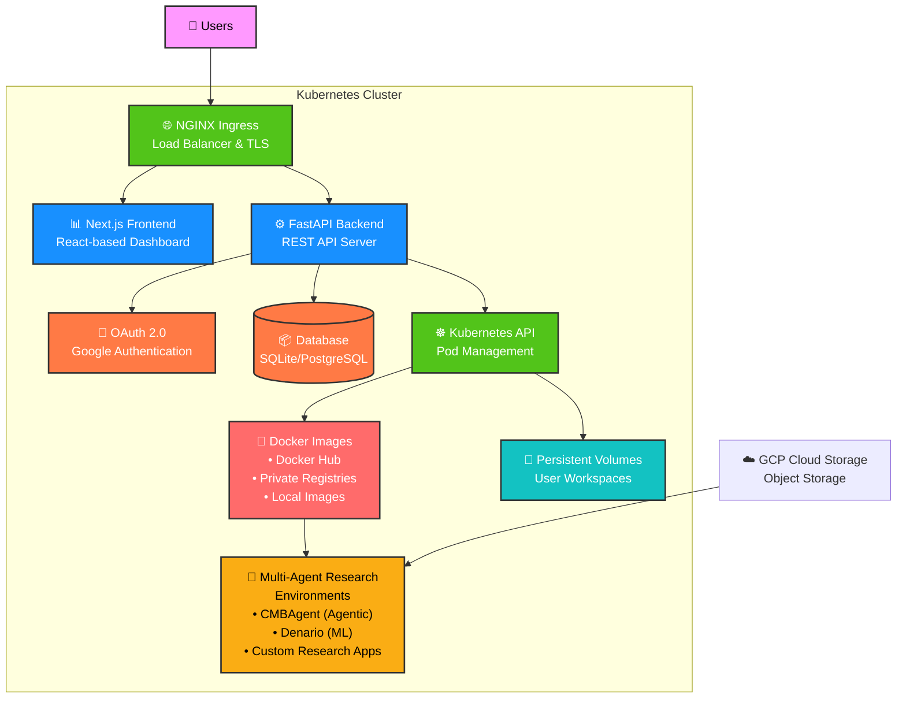

# CMBCluster

**Enterprise-Grade Multi-Tenant Research Computing Platform**

CMBCluster is a scalable, secure multi-tenant platform that provides isolated research environments for teams. Built with modern cloud-native technologies (Kubernetes, FastAPI, Next.js), it delivers professional-grade infrastructure for collaborative scientific computing.

## 🏗️ Architecture Overview



## ✨ Key Features

- 🔐 **Enterprise Security** - Google OAuth 2.0, RBAC, TLS 1.3, Network Policies
- 🚀 **Scalable Infrastructure** - Auto-scaling, load balancing, multi-cloud ready
- 🔬 **Research-Focused** - Pre-installed scientific libraries, persistent workspaces
- 📊 **Modern Dashboard** - Next.js-based UI with real-time monitoring
- ☁️ **Cloud-Native** - Kubernetes-native, Helm charts, CI/CD ready

## 📋 Tech Stack

| Component | Technology | Purpose |
|-----------|-----------|---------|
| **Frontend** | Next.js (React) | Professional dashboard and management UI |
| **Backend** | FastAPI (Python) | REST API server with async support |
| **Authentication** | Google OAuth 2.0 | Enterprise single sign-on |
| **Orchestration** | Kubernetes | Container orchestration and pod management |
| **User Environment** | Multi-Agent Research | Isolated multi-agent research environments |
| **Ingress** | NGINX | Load balancing and TLS termination |
| **Certificates** | cert-manager + Let's Encrypt | Automated SSL/TLS management |

## 🚀 Quick Start

### Local Development (2 minutes)

```bash
# 1. Clone and setup
git clone https://github.com/archetana/cmbcluster.git
cd cmbcluster
cp compose.env.example .env

# 2. Start services
docker-compose up --build

# 3. Access
# Dashboard:     http://localhost:3000
# Backend API:   http://localhost:8000
# API Docs:      http://localhost:8000/docs
```

### Production Deployment

```bash
# Prerequisites: GCP account, kubectl, helm

# 1. Setup infrastructure
./scripts/setup-cluster.sh YOUR_PROJECT_ID us-central1

# 2. Configure OAuth in Google Cloud Console
# Add redirect URI: https://your-domain.com/auth/callback

# 3. Build and deploy
./scripts/build-images.sh YOUR_PROJECT_ID
./scripts/deploy.sh YOUR_PROJECT_ID your-domain.com
```

See [DEPLOYMENT.md](docs/DEPLOYMENT.md) for detailed production setup instructions.

## 📁 Project Structure

```
cmbcluster/
├── backend/              # FastAPI REST API server
├── nextjs-frontend/      # Next.js React dashboard
├── k8s/                  # Kubernetes manifests (dev)
├── helm/                 # Helm charts (production)
├── scripts/              # Deployment automation scripts
├── compose.yml           # Local development with Docker Compose
├── README.md             # This file
├── docs/                 # Detailed documentation
│   ├── ARCHITECTURE.md   # Component architecture
│   ├── API.md            # API reference
│   ├── DEPLOYMENT.md     # Production deployment
│   ├── SECURITY.md       # Security & authentication
│   └── TROUBLESHOOTING.md # Common issues & debugging
└── planning/             # Architecture & implementation plans
```

## 📚 Documentation

- **[ARCHITECTURE.md](docs/ARCHITECTURE.md)** - Detailed component design and data flow
- **[API.md](docs/API.md)** - Complete REST API reference with examples
- **[DEPLOYMENT.md](docs/DEPLOYMENT.md)** - Production deployment on GCP (AWS coming soon)
- **[SECURITY.md](docs/SECURITY.md)** - Authentication, encryption, and security practices
- **[TROUBLESHOOTING.md](docs/TROUBLESHOOTING.md)** - Common issues and debugging guides
- **[TESTING_README.md](TESTING_README.md)** - Test suite and coverage information

## 🔧 Environment Setup

### Required Variables (Production)

```bash
PROJECT_ID=your-gcp-project-id
BASE_DOMAIN=your-domain.com
GOOGLE_CLIENT_ID=your-oauth-client-id
GOOGLE_CLIENT_SECRET=your-oauth-client-secret
SECRET_KEY=your-secure-random-key-min-32-chars
```

### Optional Configuration

```bash
DEV_MODE=false              # Enable development features
DEBUG=false                 # Enable debug logging
TOKEN_EXPIRE_HOURS=8        # JWT token expiration
MAX_USER_PODS=1             # Pods per user
FREE_TIER_MAX_UPTIME_MINUTES=60  # Free tier uptime limit
```

See [Configuration](docs/DEPLOYMENT.md#configuration) for all available options.

## 🎯 Usage

### For End Users
1. Navigate to your domain and login with Google
2. Click "Launch Environment" to start a multi-agent research environment
3. Access your isolated research workspace with pre-installed scientific libraries and agent frameworks
4. Manage files and environment variables from the dashboard


```

See [SECURITY.md](docs/SECURITY.md) for admin procedures and [TROUBLESHOOTING.md](docs/TROUBLESHOOTING.md) for common tasks.

## 🏗️ Architecture

CMBCluster consists of:

- **NGINX Ingress**: Load balancing and TLS termination
- **Next.js Frontend**: React-based management dashboard
- **FastAPI Backend**: REST API with Kubernetes integration
- **User Pods**: Isolated multi-agent research environments
- **Persistent Volumes**: Per-user workspace storage

For detailed architecture diagrams and component responsibilities, see [ARCHITECTURE.md](docs/ARCHITECTURE.md).

## 🔐 Security

- Google OAuth 2.0 authentication
- Role-based access control (RBAC)
- TLS 1.3 encryption in transit
- Network policies for pod isolation
- Content Security Policy headers
- Encrypted file storage
- Regular security audits

See [SECURITY.md](docs/SECURITY.md) for comprehensive security documentation.

## 🧪 Testing

```bash
# Backend tests
cd backend && python -m pytest tests/ -v

# Frontend tests
cd nextjs-frontend && npm test

# Local integration test
docker-compose up -d && sleep 30 && \
  curl http://localhost:8000/health && \
  curl http://localhost:3000/api/health
```

See [TESTING_README.md](TESTING_README.md) for test coverage details.

## 🐛 Troubleshooting

Common issues and solutions are documented in [TROUBLESHOOTING.md](docs/TROUBLESHOOTING.md):
- Pods won't start
- Authentication errors
- DNS/ingress issues
- Storage problems
- Performance tuning

## 📈 Roadmap

### 
- Core platform infrastructure ✅
- Google OAuth integration ✅
- Kubernetes pod orchestration ✅
- Dashboard and API ✅
- Enhanced monitoring (in progress)
- Backup system (planned)
- AWS EKS integration (in development)
- Custom container images
- Enterprise SSO (SAML/LDAP)

See full roadmap in [DEPLOYMENT.md](docs/DEPLOYMENT.md#roadmap).

## 🤝 Contributing

We welcome contributions! Please see our [CONTRIBUTING.md](CONTRIBUTING.md) for:
- Development setup
- Code standards
- Pull request process
- Testing requirements

## 📞 Support

- 📚 **Documentation**: See `docs/` directory
- 🐛 **Bug Reports**: [GitHub Issues](https://github.com/archetana/cmbcluster/issues)
- 💬 **Discussions**: [GitHub Discussions](https://github.com/archetana/cmbcluster/discussions)
- 📧 **Email**: [support@cmbcluster.io](mailto:support@cmbcluster.io)

## 📄 License

MIT License - see [LICENSE](LICENSE) file for details.

---

**Built with:** Kubernetes • FastAPI • Next.js • Docker • Helm  
**Status:** ✅ Production Ready • **Version:** 1.0.0
