# CMBCluster

Multi-tenant Streamlit Platform for Research

CMBCluster is a multi-tenant Streamlit platform designed specifically for research teams. Built on the proven JupyterHub architecture pattern, it provides isolated, persistent research environments for each user while maintaining enterprise-grade security and scalability.

### Architecture

The platform follows the JupyterHub architecture pattern with these key components:

```mermaid
graph TB
    Users[👥 Users] --> Proxy[🌐 Proxy]
    Proxy --> Hub[🎯 Hub - Authenticate user]
    
    Hub --> PV[💾 Pods + Volumes / USER SESSION]
    
    CloudVolumes[☁️ Cloud Volumes] --> PV
    ImageRegistry[📦 Image Registry] --> PV
    
    Proxy -.->|ROUTE INFOSEND| Hub
    Hub -.->|SIGNED OUTUSER REDIRECT| Proxy
    Proxy -.->|SIGNED IN USERREDIRECT| PV
    Hub -.->|VOLUME PROVIDE/POD CREATE/USER REDIRECT| PV
    Hub -.->|CULL PODSIF STALE| PV
    
    subgraph "Kubernetes Cluster"
        Proxy
        Hub
        PV
    end
    
    style Users fill:#f9f,stroke:#333,stroke-width:2px
    style Proxy fill:#9f9,stroke:#333,stroke-width:2px
    style Hub fill:#9f9,stroke:#333,stroke-width:2px
    style PV fill:#99f,stroke:#333,stroke-width:2px
    style CloudVolumes fill:#bbf,stroke:#333,stroke-width:2px
    style ImageRegistry fill:#bbf,stroke:#333,stroke-width:2px
```



## Features

### 🔐 Enterprise Security
- **Google OAuth Integration**: Seamless single sign-on
- **RBAC**: Role-based access control with admin/user permissions
- **Network Policies**: Kubernetes-native network isolation
- **Pod Security**: Non-root containers with security contexts

### 🚀 Scalable Infrastructure
- **Auto-scaling**: Horizontal pod autoscaling based on demand
- **Resource Management**: Configurable CPU/memory limits per user
- **Load Balancing**: NGINX ingress with SSL termination
- **High Availability**: Multi-replica deployments with health checks

### 🔬 Research-Focused
- **Scientific Computing**: Pre-installed research libraries (pandas, numpy, scipy, matplotlib)
- **Interactive Analysis**: Streamlit-based data exploration interface
- **Persistent Workspaces**: User data persists across sessions
- **Collaborative Tools**: Shared data access and project management

### ☁️ Cloud-Native
- **Kubernetes-Native**: Built for modern container orchestration
- **GKE Optimized**: Tested and optimized for Google Kubernetes Engine
- **Helm Charts**: Easy deployment and configuration management
- **CI/CD Ready**: GitHub Actions integration for automated deployments

## Quick Start

### Prerequisites

- **Google Cloud Platform Account** with billing enabled
- **Local Development Tools**:
  ```bash
  # macOS
  brew install google-cloud-sdk kubectl helm docker
  
  # Ubuntu/Debian
  sudo apt-get install google-cloud-sdk kubectl helm docker.io
  
  # CentOS/RHEL
  sudo yum install google-cloud-sdk kubectl helm docker
  ```
- **Domain Name** (for production deployment)

### 1. Clone Repository

```bash
git clone https://github.com/archetana/cmbcluster.git
cd cmbcluster
```

### 2. Setup Environment

```bash
# Copy environment template
cp .env.example .env

# Edit configuration
vim .env
```

Required environment variables:
```bash
PROJECT_ID=cambridge-infosys
BASE_DOMAIN=cmbcluster.yourdomain.com
GOOGLE_CLIENT_ID=your-oauth-client-id
GOOGLE_CLIENT_SECRET=your-oauth-secret
SECRET_KEY=your-generated-secret-key
```

### 3. Choose Deployment Method

#### Option A: Local Development
```bash
# Start local environment
make up

# Or using docker compose directly
docker compose up --build
```
Access the frontend at http://localhost:8501.

#### Option B: Production Deployment
```bash
# Setup GKE cluster
make setup PROJECT_ID=your-project DOMAIN=your-domain.com

# Deploy application
make deploy
```

## Local Development

### Quick Start
```bash
# Start all services using the Makefile
make up

# Or start directly with Docker Compose
docker compose up --build
```

### Access Points
- **Frontend**: `http://localhost:8501`
- **Backend API**: `http://localhost:8000`
- **API Docs**: `http://localhost:8000/docs`
- **User Environment**: `http://localhost:8502` (Sample user environment)

### Development Commands
```bash
# Build container images
make build

# Run backend tests
make test

# View logs from all running services
make logs

# Stop and remove all local services
make down

# Clean up everything (use with caution)
make clean
```

### File Structure
```
cmbcluster/
├── README.md               # This file
├── .env.example            # Environment configuration template
├── compose.yml             # Local development setup using Docker Compose
├── Makefile                # Automation scripts for build, deploy, and management
├── backend/                # FastAPI backend (Hub) for API and user session management
├── frontend/               # Main Streamlit frontend application
├── webapp/                 # (WIP) Next.js-based frontend application
├── user-environment/       # Container image for the isolated user research environment
├── packages/               # Shared packages and libraries, like the TypeScript SDK
│   └── sdk/
├── k8s/                    # Raw Kubernetes manifests for deployment
├── helm/                   # Helm chart for production deployments on Kubernetes
├── scripts/                # Utility and deployment shell scripts
├── terraform/              # (Optional) Infrastructure as Code for cloud resources
├── schema/                 # OpenAPI schema definitions
├── docs/                   # Project documentation
└── data/                   # Local database and data files
```

## Production Deployment

### 1. Setup Google Cloud Infrastructure

```bash
# Authenticate with Google Cloud
gcloud auth login
gcloud config set project YOUR_PROJECT_ID

# Setup cluster and infrastructure
./scripts/setup-cluster.sh YOUR_PROJECT_ID
```

This creates:
- GKE cluster with autoscaling (1-10 nodes)
- NGINX Ingress Controller with LoadBalancer
- cert-manager for automated SSL certificates
- Required service accounts and RBAC policies
- Storage classes for persistent volumes

### 2. Configure OAuth

1. Go to [Google Cloud Console](https://console.cloud.google.com/)
2. Navigate to **APIs & Services > Credentials**
3. Create **OAuth 2.0 Client ID**
4. Add authorized redirect URIs:
   ```
   https://api.yourdomain.com/auth/callback
   ```
5. Update `.env` with client ID and secret

### 3. Deploy Application

```bash
# Build and push container images
./scripts/build-images.sh YOUR_PROJECT_ID

# Deploy with Helm
./scripts/deploy.sh YOUR_PROJECT_ID yourdomain.com
```

### 4. Configure DNS

Point your domain to the ingress IP:
```bash
# Get ingress IP
kubectl get ingress -n cmbcluster

# Create DNS records:
# A record: yourdomain.com -> INGRESS_IP
# A record: *.yourdomain.com -> INGRESS_IP  
# A record: api.yourdomain.com -> INGRESS_IP
```

## Usage

### For Users

1. **Access Platform**: Navigate to `https://yourdomain.com`
2. **Login**: Click "🔐 Login with Google" and authenticate
3. **Launch Environment**: Click ":material/rocket_launch: Launch Environment" to create your research pod
4. **Start Research**: Access your isolated Streamlit environment with:
   - Pre-installed research libraries (pandas, numpy, scipy, matplotlib)
   - Persistent workspace storage (`/workspace`)
   - Scientific computing tools (NumPy, SciPy, Matplotlib)
   - Data visualization capabilities (Plotly, Seaborn)

### User Environment Features

```python
# Pre-installed libraries available in user environments
import numpy as np
import scipy as sp
import matplotlib.pyplot as plt
import pandas as pd
import plotly.express as px
import astropy
import healpy as hp
import camb

# Persistent workspace
workspace_dir = "/workspace"  # Your files persist here
```

### For Administrators

```bash
# Monitor deployments
kubectl get pods -n cmbcluster

# View logs
kubectl logs -f deployment/cmbcluster-backend -n cmbcluster
kubectl logs -f deployment/cmbcluster-frontend -n cmbcluster

# Scale deployments
kubectl scale deployment cmbcluster-backend --replicas=5 -n cmbcluster

# List user environments
kubectl get pods -l app=cmbcluster-user-env -n cmbcluster

# Clean up inactive environments
kubectl delete pods -l app=cmbcluster-user-env --field-selector status.phase=Succeeded -n cmbcluster
```

## Configuration

### Environment Variables

| Variable | Description | Default | Required |
|----------|-------------|---------|----------|
| `PROJECT_ID` | GCP Project ID | - | ✅ |
| `BASE_DOMAIN` | Platform domain | `cmbcluster.local` | ✅ |
| `GOOGLE_CLIENT_ID` | OAuth Client ID | - | ✅ |
| `GOOGLE_CLIENT_SECRET` | OAuth Secret | - | ✅ |
| `SECRET_KEY` | JWT signing key | - | ✅ |
| `MAX_INACTIVE_HOURS` | Auto-cleanup time | `4` | ❌ |
| `MAX_USER_PODS` | Pods per user | `1` | ❌ |
| `TOKEN_EXPIRE_HOURS` | JWT expiration | `8` | ❌ |
| `NAMESPACE` | Kubernetes namespace | `cmbcluster` | ❌ |

### Resource Limits

Default user environment resources:
```yaml
userEnvironment:
  defaultResources:
    requests:
      cpu: 100m
      memory: 256Mi
    limits:
      cpu: 2000m
      memory: 4Gi
  storage:
    size: 10Gi
    storageClass: standard-rwo
```

### Helm Configuration

Customize deployment in `helm/values.yaml`:
```yaml
# Backend scaling
backend:
  replicaCount: 2
  resources:
    limits:
      cpu: 1000m
      memory: 1Gi

# Frontend scaling  
frontend:
  replicaCount: 2
  
# Auto-scaling
autoscaling:
  enabled: true
  minReplicas: 1
  maxReplicas: 10
```

## Architecture Details

### Component Responsibilities

#### 🌐 Proxy (NGINX Ingress)
- **Route Info Send**: Forward user requests to Hub
- **User Routing**: Direct authenticated users to their pods
- **SSL Termination**: Handle HTTPS certificates
- **Load Balancing**: Distribute traffic across replicas

#### 🎯 Hub (Backend Service)
- **Authenticate User**: Google OAuth integration
- **Signed Out User Redirect**: Send unauthenticated users to login
- **Volume Provide/Pod Create**: Provision user resources
- **User Redirect**: Route users to their environments
- **Cull Pods If Stale**: Clean up inactive environments

#### 🔬 Pods + Volumes
- **Image Pull**: Download user environment containers
- **User Session**: Maintain persistent workspace state
- **Resource Isolation**: Dedicated CPU/memory/storage per user
- **Data Persistence**: User files survive pod restarts

### Data Flow

```
1. User → Proxy → Hub (check authentication)
2. Hub → Google OAuth (if not authenticated)  
3. Hub → Create/Find User Pod
4. Proxy → User Pod (direct traffic)
5. User Pod → Streamlit App (research environment)
```

## Monitoring

### Health Checks

```bash
# Check all services
kubectl get pods -n cmbcluster

# Backend health
curl https://api.yourdomain.com/health

# Frontend health  
curl https://yourdomain.com/_stcore/health
```

### Logs

```bash
# Backend logs
kubectl logs -f deployment/cmbcluster-backend -n cmbcluster

# Frontend logs
kubectl logs -f deployment/cmbcluster-frontend -n cmbcluster

# User environment logs
kubectl logs  -n cmbcluster

# Ingress logs
kubectl logs -f deployment/ingress-nginx-controller -n ingress-nginx
```

### Metrics

The platform exposes Prometheus metrics:
```
# Backend metrics
cmbcluster_active_users
cmbcluster_pods_created_total
cmbcluster_authentication_requests_total

# Resource metrics  
cmbcluster_cpu_usage
cmbcluster_memory_usage
cmbcluster_storage_usage
```

## Security

### Authentication Flow


### Security Features
- **TLS 1.3**: All traffic encrypted in transit
- **Network Policies**: Pod-to-pod communication restrictions
- **Pod Security**: Non-root containers, read-only filesystems
- **RBAC**: Kubernetes role-based access control
- **Secrets Management**: Encrypted credential storage

### Data Protection
- **Workspace Isolation**: Each user has dedicated storage
- **Encryption at Rest**: Persistent volumes encrypted
- **Data Retention**: Configurable cleanup policies
- **Backup Support**: Regular workspace backups

## Troubleshooting

### Common Issues

#### Pod Won't Start
```bash
# Check pod status
kubectl get pods -n cmbcluster
kubectl describe pod  -n cmbcluster
kubectl logs  -n cmbcluster

# Common causes:
# - Image pull errors
# - Resource constraints  
# - Storage mounting issues
```

#### Authentication Errors
```bash
# Check OAuth configuration
kubectl get secret cmbcluster-secrets -n cmbcluster -o yaml

# Verify redirect URLs in Google Cloud Console
# Ensure domain matches configuration
```

#### Ingress Issues
```bash
# Check ingress status
kubectl get ingress -n cmbcluster
kubectl describe ingress cmbcluster-ingress -n cmbcluster

# Verify certificates
kubectl get certificates -n cmbcluster
kubectl describe certificate cmbcluster-tls -n cmbcluster
```

#### Storage Problems
```bash
# Check persistent volumes
kubectl get pv
kubectl get pvc -n cmbcluster

# Storage class issues
kubectl get storageclass
```

### Debug Commands

```bash
# Get all resources
kubectl get all -n cmbcluster

# Check events
kubectl get events -n cmbcluster --sort-by='.lastTimestamp'

# Pod shell access (for debugging)
kubectl exec -it  -n cmbcluster -- /bin/bash

# Port forwarding for local access
kubectl port-forward service/cmbcluster-backend 8000:80 -n cmbcluster
```

## Testing

### Unit Tests
```bash
# Backend tests
cd backend
python -m pytest tests/

# Frontend tests  
cd frontend
python -m pytest tests/
```

### Integration Tests
```bash
# End-to-end testing
pytest tests/integration/

# Load testing
locust -f tests/load/locustfile.py
```

### Development Testing
```bash
# Test local deployment
make dev
curl http://localhost:8000/health
curl http://localhost:8501/_stcore/health
```

## Contributing

We welcome contributions! Please see our [Contributing Guide](CONTRIBUTING.md) for details.

### Development Workflow

```bash
# 1. Fork and clone repository
git clone https://github.com/yourusername/cmbcluster.git
cd cmbcluster

# 2. Create feature branch
git checkout -b feature/your-feature-name

# 3. Make changes and test locally
make dev
make test

# 4. Commit and push
git commit -m "Add your feature"
git push origin feature/your-feature-name

# 5. Create pull request
```

### Code Standards
- **Python**: Follow PEP 8, use Black formatter
- **Docker**: Multi-stage builds, minimal base images
- **Kubernetes**: Follow security best practices
- **Documentation**: Update README and inline docs

## Roadmap

### Near Term (Q1 2025)
- [ ] **GPU Support**: CUDA-enabled environments for ML workloads
- [ ] **Advanced Monitoring**: Grafana dashboards and alerting
- [ ] **User Quotas**: Storage and compute limits per user
- [ ] **Backup System**: Automated workspace backups

### Medium Term (Q2-Q3 2025)
- [ ] **Multi-cloud Support**: AWS EKS and Azure AKS deployment
- [ ] **Jupyter Integration**: Built-in Jupyter notebook support
- [ ] **Collaborative Features**: Real-time collaboration tools
- [ ] **Data Pipeline Integration**: Connect with external data sources

### Long Term (Q4 2025+)
- [ ] **Enterprise SSO**: SAML and LDAP integration
- [ ] **Advanced Analytics**: Usage analytics and cost optimization
- [ ] **Custom Environments**: User-defined container images
- [ ] **Federation**: Multi-cluster deployments

## Support

### Getting Help

- 📚 **Documentation**: [GitHub Wiki](https://github.com/archetana/cmbcluster/wiki)
- 🐛 **Bug Reports**: [Issue Tracker](https://github.com/archetana/cmbcluster/issues)
- 💬 **Discussions**: [GitHub Discussions](https://github.com/archetana/cmbcluster/discussions)
- 📧 **Email**: [support@cmbcluster.io](mailto:support@cmbcluster.io)

### Community

- **Slack**: Join our [CMBCluster Slack](https://cmbcluster.slack.com)
- **Monthly Meetings**: First Friday of each month at 10 AM PST
- **Office Hours**: Wednesdays 2-3 PM PST

## License

This project is licensed under the MIT License - see the [LICENSE](LICENSE) file for details.

## Acknowledgments

- Built on the [JupyterHub](https://jupyter.org/hub) architecture pattern
- Inspired by the research community needs
- Special thanks to early adopters and contributors
- Container orchestration powered by [Kubernetes](https://kubernetes.io/)

**CMBCluster** - Empowering research through scalable, secure, and collaborative computing environments.

For more information, visit our [GitHub repository](https://github.com/archetana/cmbcluster) or contact us at [support@cmbcluster.io](mailto:support@cmbcluster.io).

[1] https://pplx-res.cloudinary.com/image/private/user_uploads/55150389/b6a3b9f3-c4a1-40cc-a9f2-7cca9d35b398/image.jpg
