# CMBCluster

**Enterprise-Grade Multi-Tenant Research Computing Platform**

CMBCluster is a scalable, secure multi-tenant platform that provides isolated research environments for teams. Built with modern cloud-native technologies, it delivers professional-grade infrastructure for collaborative scientific computing with automatic resource management, comprehensive security controls, and seamless user experience.

## 🏗️ Architecture Overview

CMBCluster follows a modern, cloud-native architecture pattern combining frontend, API backend, and isolated user environments:

```mermaid
graph TB
    Users[👥 Users] --> Ingress[🌐 NGINX Ingress<br/>Load Balancer & TLS]
    
    Ingress --> Frontend[📊 Next.js Frontend<br/>React-based Dashboard]
    Ingress --> API[⚙️ FastAPI Backend<br/>REST API Server]
    
    API --> Auth[🔐 OAuth 2.0<br/>Google Authentication]
    API --> DB[(📦 Database<br/>SQLite/PostgreSQL)]
    API --> K8s[☸️ Kubernetes API<br/>Pod Management]
    
    K8s --> UserPods[🔬 User Environment Pods<br/>Isolated Streamlit Apps]
    K8s --> Storage[💾 Persistent Volumes<br/>User Workspaces]
    
    CloudVolumes[☁️ Cloud Storage<br/>GCS/AWS S3] -.->|Optional| UserPods
    
    subgraph "Kubernetes Cluster"
        Ingress
        Frontend
        API
        Auth
        DB
        K8s
        UserPods
        Storage
    end
    
    style Users fill:#f9f,stroke:#333,stroke-width:2px
    style Ingress fill:#9f9,stroke:#333,stroke-width:2px
    style Frontend fill:#99f,stroke:#333,stroke-width:2px
    style API fill:#99f,stroke:#333,stroke-width:2px
    style Auth fill:#fc9,stroke:#333,stroke-width:2px
    style DB fill:#fc9,stroke:#333,stroke-width:2px
    style K8s fill:#9f9,stroke:#333,stroke-width:2px
    style UserPods fill:#ff9,stroke:#333,stroke-width:2px
    style Storage fill:#9fc,stroke:#333,stroke-width:2px
```



## Key Features

### 🔐 Enterprise Security
- **Google OAuth 2.0**: Seamless single sign-on with Google accounts
- **Role-Based Access Control (RBAC)**: Admin and user permission levels with configurable admin emails
- **Network Policies**: Kubernetes-native network isolation between user pods
- **Pod Security Standards**: Non-root containers with read-only filesystems
- **Content Security Policy (CSP)**: Comprehensive HTTP security headers
- **TLS 1.3 Encryption**: All traffic encrypted in transit with automatic certificate management
- **Session Management**: Secure cookie-based sessions with configurable timeouts
- **JWT Authentication**: Stateless authentication with configurable expiration

### 🚀 Scalable Infrastructure
- **Horizontal Pod Autoscaling**: Automatic scaling based on resource demand (1-10 nodes default)
- **Resource Management**: Configurable CPU/memory limits and requests per user pod
- **Load Balancing**: NGINX ingress controller with SSL/TLS termination
- **High Availability**: Multi-replica deployments with liveness and readiness probes
- **Persistent Storage**: Per-user persistent volumes with configurable storage classes
- **Multi-cloud Support**: GKE, EKS, and AKS compatible

### 🔬 Research-Focused Features
- **Research Environments**: Isolated Streamlit-based workspaces for each user
- **Scientific Libraries**: Pre-installed research tools (NumPy, SciPy, Pandas, Matplotlib, Astropy, HEALPy, CAMB)
- **Persistent Workspaces**: User data persists across sessions in dedicated volumes
- **Environment Variables**: Secure per-user environment variable management
- **File Management**: Encrypted file upload and storage with cloud integration
- **Application Catalog**: Support for custom research applications

### ☁️ Cloud-Native Architecture
- **Kubernetes-Native**: Full Kubernetes native implementation with no external dependencies
- **Helm Charts**: Production-ready Helm charts for easy deployment and upgrades
- **Container Images**: Optimized multi-stage Docker builds for minimal image size
- **Auto-scaling**: Horizontal pod autoscaling for both frontend and backend services
- **GCS FUSE**: Optional GCS FUSE mount for direct cloud storage access
- **CI/CD Ready**: GitHub Actions integration for automated builds and deployments

### 📊 Modern User Interface
- **Next.js Dashboard**: Professional, responsive React-based management dashboard
- **Real-time Status**: Live pod status monitoring and environment management
- **Application Management**: Browse and launch multiple research applications
- **File Manager**: Upload, organize, and manage research files
- **Activity Logs**: Comprehensive audit trails and user activity tracking
- **Dark Mode**: Modern UI with light and dark theme support

## Quick Start

### Prerequisites

- **Google Cloud Platform Account** (with billing enabled for production)
  - Or AWS/Azure account for alternative cloud providers
- **Local Development Tools**:
  ```bash
  # macOS (Homebrew)
  brew install google-cloud-sdk kubectl helm docker
  
  # Ubuntu/Debian
  sudo apt-get install google-cloud-sdk kubectl helm docker.io
  
  # Windows (with WSL2)
  # Install via Windows Package Manager or manual downloads
  ```
- **Domain Name** (for production deployments only)
- **Docker & Docker Compose** (for local development)

### 1. Clone Repository

```bash
git clone https://github.com/archetana/cmbcluster.git
cd cmbcluster
```

### 2. Setup Environment

```bash
# Copy environment template
cp compose.env.example .env

# Edit with your configuration
vim .env  # or use your preferred editor
```

**Required environment variables:**
```bash
PROJECT_ID=cmbcluster-dev
BASE_DOMAIN=cmbcluster.local
GOOGLE_CLIENT_ID=your-google-oauth-client-id
GOOGLE_CLIENT_SECRET=your-google-oauth-client-secret
SECRET_KEY=your-secure-random-key-min-32-chars
```

### 3. Local Development (Docker Compose)

```bash
# Start all services
docker-compose up --build

# Access points:
# Dashboard:     http://localhost:3000
# Backend API:   http://localhost:8000
# API Docs:      http://localhost:8000/docs
# User Env Demo: http://localhost:8502 (optional Streamlit demo)
```

### 4. Production Deployment (Kubernetes)

```bash
# Setup GKE cluster and infrastructure
./scripts/setup-cluster.sh YOUR_PROJECT_ID YOUR_REGION

# Build and push container images
./scripts/build-images.sh YOUR_PROJECT_ID

# Deploy with Helm
./scripts/deploy.sh YOUR_PROJECT_ID your-domain.com
```

## Local Development

### Quick Start
```bash
# Start all services
docker-compose up --build

# Access points:
Dashboard:       http://localhost:3000
Backend API:     http://localhost:8000
API Docs:        http://localhost:8000/docs
Health Check:    http://localhost:8000/health
```

### Development Commands
```bash
# Make scripts executable
chmod +x scripts/*.sh

# Build images (locally)
./scripts/build-images.sh

# Run backend tests
cd backend && python -m pytest tests/

# Run frontend tests  
cd nextjs-frontend && npm test

# Stop services
docker-compose down

# Clean up everything
docker-compose down -v
```

### Project Structure
```
cmbcluster/
├── README.md                      # This file
├── compose.yml                    # Docker Compose for local development
├── compose.env.example            # Environment template
├── Makefile                       # Build and deployment commands
├── .env.example                   # Configuration template
│
├── backend/                       # FastAPI REST API Server
│   ├── main.py                   # Application entry point
│   ├── config.py                 # Configuration management
│   ├── models.py                 # Data models
│   ├── database.py               # Database initialization
│   ├── auth.py                   # OAuth 2.0 authentication
│   ├── pod_manager.py            # Kubernetes pod orchestration
│   ├── storage_manager.py        # Cloud storage integration
│   ├── file_encryption.py        # File encryption utilities
│   ├── requirements.txt          # Python dependencies
│   ├── Dockerfile                # Backend container image
│   ├── pytest.ini                # Test configuration
│   └── tests/                    # Unit and integration tests
│       ├── test_auth.py
│       ├── test_config.py
│       └── test_pod_manager.py
│
├── nextjs-frontend/              # Next.js React Dashboard
│   ├── next.config.js            # Next.js configuration
│   ├── package.json              # Node.js dependencies
│   ├── tsconfig.json             # TypeScript configuration
│   ├── tailwind.config.js        # Tailwind CSS configuration
│   ├── Dockerfile                # Frontend container image
│   ├── src/
│   │   ├── app/                  # Next.js app router
│   │   ├── components/           # React components
│   │   ├── contexts/             # React contexts
│   │   └── lib/                  # Utility functions
│   └── public/                   # Static assets
│
├── k8s/                          # Kubernetes manifests (development)
│   ├── namespace.yaml
│   ├── backend-deployment.yaml
│   ├── frontend-deployment.yaml
│   ├── ingress.yaml
│   └── rbac.yaml
│
├── helm/                         # Helm charts (production)
│   ├── Chart.yaml
│   ├── values.yaml
│   └── templates/
│       ├── backend.yaml
│       ├── frontend.yaml
│       ├── ingress.yaml
│       └── rbac.yaml
│
├── scripts/                      # Deployment and utility scripts
│   ├── setup-cluster.sh          # Initialize GKE cluster
│   ├── build-images.sh           # Build and push Docker images
│   ├── deploy.sh                 # Deploy with Helm
│   ├── cleanup.sh                # Clean up resources
│   └── local-dev.sh              # Local development setup
│
└── planning/                     # Architecture and implementation docs
    ├── DEPLOYMENT_AGNOSTIC_AUTH.md
    └── [other planning documents]
```

## Production Deployment

### Prerequisites
- GCP/AWS/Azure account with billing enabled
- `gcloud`, `kubectl`, and `helm` installed and configured
- Domain name with DNS access
- Docker registry (GCR, ECR, or Docker Hub)

### Step 1: Initialize Infrastructure

```bash
# Authenticate with Google Cloud (for GKE)
gcloud auth login
gcloud config set project YOUR_PROJECT_ID

# Create GKE cluster with auto-scaling
./scripts/setup-cluster.sh YOUR_PROJECT_ID us-central1

# This creates:
# - GKE cluster (1-10 nodes with autoscaling)
# - NGINX Ingress Controller
# - cert-manager for automated SSL/TLS
# - Service accounts and RBAC policies
# - Storage classes for persistent volumes
```

### Step 2: Configure Google OAuth

1. Go to [Google Cloud Console](https://console.cloud.google.com/)
2. Navigate to **APIs & Services > Credentials**
3. Create **OAuth 2.0 Client ID** (type: Web application)
4. Add authorized redirect URIs:
   ```
   https://your-domain.com/auth/callback
   https://api.your-domain.com/auth/callback
   ```
5. Copy credentials and update `.env`:
   ```bash
   GOOGLE_CLIENT_ID=your-client-id
   GOOGLE_CLIENT_SECRET=your-client-secret
   ```

### Step 3: Build and Push Images

```bash
# Build and push container images to Google Container Registry
./scripts/build-images.sh YOUR_PROJECT_ID

# Or use Docker Hub
docker build -t your-registry/cmbcluster-backend:latest ./backend
docker build -t your-registry/cmbcluster-frontend:latest ./nextjs-frontend
docker push your-registry/cmbcluster-backend:latest
docker push your-registry/cmbcluster-frontend:latest
```

### Step 4: Deploy with Helm

```bash
# Update values.yaml with your configuration
vim helm/values.yaml

# Deploy the application
./scripts/deploy.sh YOUR_PROJECT_ID your-domain.com

# Or deploy manually:
helm install cmbcluster ./helm \
  --namespace cmbcluster \
  --create-namespace \
  -f helm/values.yaml
```

### Step 5: Configure DNS

Get the ingress IP and configure DNS records:
```bash
# Get ingress IP
kubectl get ingress -n cmbcluster

# Create DNS records (A records pointing to ingress IP):
your-domain.com             -> INGRESS_IP
api.your-domain.com         -> INGRESS_IP
*.your-domain.com           -> INGRESS_IP (optional, for subdomains)
```

### Step 6: Verify Deployment

```bash
# Check all pods are running
kubectl get pods -n cmbcluster

# Check ingress status
kubectl get ingress -n cmbcluster

# Check TLS certificate status
kubectl get certificates -n cmbcluster

# View backend logs
kubectl logs -f deployment/cmbcluster-backend -n cmbcluster

# View frontend logs
kubectl logs -f deployment/cmbcluster-frontend -n cmbcluster
```

## Usage Guide

### For End Users

#### Accessing the Platform
1. Navigate to `https://your-domain.com`
2. Click **"Login with Google"** and authenticate with your Google account
3. Review and accept permissions
4. Access the dashboard

#### Creating a Research Environment
1. Click **"Launch Environment"** button on the dashboard
2. Select a research application from the catalog (or use default)
3. Configure optional settings (name, compute resources, etc.)
4. Click **"Create"** and wait for pod initialization (~30-60 seconds)
5. Click **"Open Environment"** to launch your Streamlit workspace

#### Your Research Environment
Inside your isolated environment, you have:

```python
# Available scientific libraries
import numpy as np
import scipy as sp
import matplotlib.pyplot as plt
import pandas as pd
import plotly.express as px
import astropy
import healpy as hp
import camb

# Persistent workspace directory
workspace_dir = "/workspace"  # Files persist across sessions

# Upload/download files
# Use the file manager in the dashboard
```

**Features in your environment:**
- Persistent storage at `/workspace` (~10GB default)
- Access to environment variables you've configured
- Internet connectivity for package installations
- Pre-installed scientific tools and libraries

#### Managing Environment Variables
1. Go to Dashboard → **"Settings"**
2. Click **"Environment Variables"**
3. Add/edit/delete variables (e.g., API keys, credentials)
4. Variables are injected into your pod automatically

#### File Management
1. Go to Dashboard → **"Files"**
2. Upload research data, scripts, or other files
3. Files are stored in `/workspace` and accessible in your environment
4. Download files back to your local machine

#### Auto-Shutdown Policy
- **Free Tier**: Environments auto-shutdown after 60 minutes of uptime
- **Premium**: Longer uptime limits (check subscription status)
- **Warning**: You'll receive a warning 10 minutes before shutdown
- **Manual Shutdown**: Click "Stop Environment" to shut down immediately

### For Administrators

#### Monitoring the Cluster
```bash
# View all resources
kubectl get all -n cmbcluster

# Check pod status
kubectl get pods -n cmbcluster -w

# View recent events
kubectl get events -n cmbcluster --sort-by='.lastTimestamp'

# Monitor resource usage
kubectl top nodes
kubectl top pods -n cmbcluster
```

#### Managing Users
```bash
# List all users
kubectl exec -it deployment/cmbcluster-backend -n cmbcluster -- \
  sqlite3 /app/data/cmbcluster.db \
  "SELECT * FROM users;"

# Grant admin access
# Edit the config and add email to ADMIN_EMAILS environment variable
kubectl set env deployment/cmbcluster-backend \
  ADMIN_EMAILS="user@example.com" -n cmbcluster
```

#### Managing User Environments
```bash
# List all active user pods
kubectl get pods -l app=user-environment -n cmbcluster

# Get detailed pod info
kubectl describe pod POD_NAME -n cmbcluster

# View pod logs
kubectl logs POD_NAME -n cmbcluster

# Delete a specific user pod (force shutdown)
kubectl delete pod POD_NAME -n cmbcluster

# Stop all user pods
kubectl delete pods -l app=user-environment -n cmbcluster

# Monitor environment uptime
kubectl exec -it deployment/cmbcluster-backend -n cmbcluster -- \
  python -c "from database import get_database; \
  import asyncio; \
  db = get_database(); \
  asyncio.run(db.get_all_environments())" | head -20
```

#### Scaling the Platform
```bash
# Scale backend replicas
kubectl scale deployment cmbcluster-backend --replicas=5 -n cmbcluster

# Scale frontend replicas
kubectl scale deployment cmbcluster-frontend --replicas=3 -n cmbcluster

# Configure auto-scaling (if enabled)
kubectl get hpa -n cmbcluster
kubectl patch hpa cmbcluster-backend -p '{"spec":{"maxReplicas":20}}' -n cmbcluster
```

#### Viewing Logs
```bash
# Backend logs
kubectl logs -f deployment/cmbcluster-backend -n cmbcluster --tail=100

# Frontend logs
kubectl logs -f deployment/cmbcluster-frontend -n cmbcluster --tail=100

# Specific pod logs
kubectl logs -f POD_NAME -n cmbcluster

# Previous pod logs (if pod crashed)
kubectl logs POD_NAME -n cmbcluster --previous
```

#### Database Management
```bash
# Connect to database directly
kubectl exec -it deployment/cmbcluster-backend -n cmbcluster -- \
  sqlite3 /app/data/cmbcluster.db

# Backup database
kubectl exec deployment/cmbcluster-backend -n cmbcluster -- \
  cp /app/data/cmbcluster.db /app/data/cmbcluster.db.backup

# Export user activity logs
kubectl exec -it deployment/cmbcluster-backend -n cmbcluster -- \
  sqlite3 /app/data/cmbcluster.db \
  ".mode csv" \
  "SELECT * FROM activity_logs;" > activity_logs.csv
```

#### Storage Management
```bash
# Check persistent volume usage
kubectl get pvc -n cmbcluster
kubectl describe pvc -n cmbcluster

# Increase user storage quota
# Edit helm/values.yaml and update userStorage.size

# List files in user workspace (if mounted locally)
find /mnt/workspaces -type f | head -20
```

## Configuration

### Environment Variables

| Variable | Description | Default | Required | Type |
|----------|-------------|---------|----------|------|
| `PROJECT_ID` | GCP/cloud project ID | `cmbcluster-dev` | ✅ | String |
| `BASE_DOMAIN` | Platform domain name | `cmbcluster.local` | ✅ | String |
| `GOOGLE_CLIENT_ID` | OAuth 2.0 Client ID | - | ✅ | String |
| `GOOGLE_CLIENT_SECRET` | OAuth 2.0 Client Secret | - | ✅ | String |
| `SECRET_KEY` | JWT signing key (min 32 chars) | `dev-secret-key` | ✅ | String |
| `API_URL` | Backend API URL | `http://localhost:8000` | - | String |
| `FRONTEND_URL` | Frontend URL | `http://localhost:3000` | - | String |
| `NAMESPACE` | Kubernetes namespace | `cmbcluster` | - | String |
| `DEV_MODE` | Development mode (allows docs, debug logging) | `false` | - | Boolean |
| `DEBUG` | Debug mode (verbose logging) | `false` | - | Boolean |
| `ADMIN_EMAILS` | Comma-separated admin emails | - | - | String |
| `TOKEN_EXPIRE_HOURS` | JWT token expiration (hours) | `8` | - | Integer |
| `SESSION_TIMEOUT_MINUTES` | Session timeout (minutes) | `480` | - | Integer |
| `FREE_TIER_MAX_UPTIME_MINUTES` | Free tier uptime limit | `60` | - | Integer |
| `AUTO_SHUTDOWN_CHECK_INTERVAL_MINUTES` | Auto-shutdown check frequency | `5` | - | Integer |
| `SHUTDOWN_WARNING_MINUTES` | Warning time before shutdown | `10` | - | Integer |
| `MAX_USER_PODS` | Maximum pods per user | `1` | - | Integer |
| `REGISTRY_URL` | Container registry URL | `gcr.io/PROJECT_ID` | - | String |
| `STORAGE_CLASS_NAME` | Kubernetes storage class | `standard-rwo` | - | String |
| `TLS_ENABLED` | Enable HTTPS/TLS | `true` | - | Boolean |
| `ENABLE_SECURITY_HEADERS` | Enable CSP and security headers | `true` | - | Boolean |
| `CSP_ENABLED` | Content Security Policy enabled | `true` | - | Boolean |
| `LOG_AUTH_EVENTS` | Log authentication events | `true` | - | Boolean |
| `LOG_SECURITY_EVENTS` | Log security events | `true` | - | Boolean |

### Application Configuration (helm/values.yaml)

```yaml
# Replica counts
backend:
  replicaCount: 2
frontend:
  replicaCount: 2

# Resource limits for backend
backend:
  resources:
    requests:
      cpu: 100m
      memory: 256Mi
    limits:
      cpu: 1000m
      memory: 1Gi

# Resource limits for user environments
userEnvironment:
  defaultResources:
    requests:
      cpu: 100m
      memory: 256Mi
    limits:
      cpu: 2000m      # 2 CPU cores
      memory: 4Gi     # 4GB RAM

# Persistent storage
userStorage:
  size: 10Gi
  storageClass: standard-rwo

# Auto-scaling
autoscaling:
  enabled: true
  minReplicas: 1
  maxReplicas: 10
  targetCPUUtilizationPercentage: 70
```

### Security Configuration

**TLS/HTTPS:**
- Automatically managed by cert-manager (Let's Encrypt)
- Update in `helm/templates/ingress.yaml`

**CORS:**
- Automatically configured based on `BASE_DOMAIN` and `FRONTEND_URL`
- Customize in `backend/config.py` → `get_allowed_origins()`

**Network Policies:**
- Located in `helm/templates/network-policy.yaml`
- Restrict pod-to-pod communication

**RBAC:**
- Service accounts defined in `helm/templates/serviceaccount.yaml`
- Permissions in `helm/templates/rbac.yaml`

## Architecture Details

### Component Responsibilities

#### 🌐 NGINX Ingress Controller
- **Request Routing**: Route HTTP/HTTPS traffic to appropriate services
- **TLS Termination**: Handle SSL/TLS encryption and certificate management
- **Load Balancing**: Distribute traffic across multiple replicas
- **Path-based Routing**: Route `/api/*` to backend, `/` to frontend
- **Rate Limiting**: Optional request rate limiting configuration

#### 📊 Next.js Frontend Service
- **User Dashboard**: Professional React-based management interface
- **Authentication**: OAuth 2.0 login flow and session management
- **Environment Management**: Create, monitor, and delete user pods
- **File Management**: Upload/download files and manage workspace
- **Settings**: User preferences, environment variables, account settings
- **Monitoring**: Real-time pod status and activity tracking
- **API Integration**: Communicate with FastAPI backend via HTTP

#### ⚙️ FastAPI Backend Service
- **REST API**: Provide endpoints for all platform operations
- **Authentication**: Google OAuth 2.0 integration with JWT tokens
- **Pod Orchestration**: Create and manage Kubernetes pods via client-go
- **User Management**: Track users, permissions, and subscriptions
- **Database**: Store user data, activity logs, and pod information
- **Storage Integration**: Manage cloud storage (GCS, S3) and persistent volumes
- **File Encryption**: Encrypt sensitive files and credentials
- **Health Monitoring**: Track pod uptime and auto-shutdown

#### ☸️ Kubernetes API Server
- **Pod Lifecycle**: Create, monitor, and delete user environment pods
- **Namespace Isolation**: Each user pod runs in `cmbcluster` namespace
- **Resource Quotas**: Enforce CPU/memory limits per pod
- **Secret Management**: Store OAuth credentials, encryption keys, environment variables
- **RBAC**: Control access to Kubernetes resources
- **Service Discovery**: DNS-based service communication

#### 🔬 User Environment Pods
- **Streamlit Application**: Interactive research notebook interface
- **Scientific Libraries**: Pre-installed NumPy, SciPy, Pandas, Matplotlib, etc.
- **Persistent Volume**: User workspace stored at `/workspace`
- **Isolated Execution**: Network and filesystem isolation from other users
- **Environment Variables**: Injected at pod startup
- **Health Monitoring**: Liveness and readiness probes

### Data Flow Diagram

```
┌─────────────────────────────────────────────────────────────────┐
│ 1. User Accesses Platform                                       │
├─────────────────────────────────────────────────────────────────┤
│                                                                  │
│   User → [HTTPS] → NGINX Ingress → Frontend (Next.js)          │
│                      ↓ (/)          [React Dashboard]           │
│              Displays login page                                │
│              User clicks "Login with Google"                    │
│                                                                  │
└─────────────────────────────────────────────────────────────────┘

┌─────────────────────────────────────────────────────────────────┐
│ 2. Authentication                                               │
├─────────────────────────────────────────────────────────────────┤
│                                                                  │
│   Frontend → Backend (/auth/login) → Google OAuth              │
│              [REST API]              [Redirect to Google]       │
│                ↓                                                 │
│   User grants permissions → Google → Backend /auth/callback     │
│                                        [Create JWT Token]       │
│              ← Returns token ← Frontend ← Backend                │
│                                                                  │
│   Token stored in secure session cookie                        │
│                                                                  │
└─────────────────────────────────────────────────────────────────┘

┌─────────────────────────────────────────────────────────────────┐
│ 3. User Launches Environment                                    │
├─────────────────────────────────────────────────────────────────┤
│                                                                  │
│   Frontend → Backend (/environments) [with JWT token]          │
│              [Create Environment Request]                       │
│              ↓                                                   │
│   Backend → Kubernetes API [Create Pod]                        │
│              [User env pod manifest]                            │
│              ↓                                                   │
│   Kubernetes pulls image, mounts volumes, starts pod            │
│              ↓                                                   │
│   Pod becomes ready, Streamlit starts                           │
│              ↓                                                   │
│   Backend returns pod URL to Frontend                           │
│              ↓                                                   │
│   Frontend displays pod status and connection link              │
│                                                                  │
└─────────────────────────────────────────────────────────────────┘

┌─────────────────────────────────────────────────────────────────┐
│ 4. User Works in Environment                                    │
├─────────────────────────────────────────────────────────────────┤
│                                                                  │
│   User Pod (Streamlit) ← User Browser [/user-env/user-123]    │
│   [Isolated Container]   [WebSocket via NGINX]                 │
│   ├─ Workspace storage (/workspace)                            │
│   ├─ Environment variables                                      │
│   ├─ Scientific libraries                                       │
│   └─ Network connectivity                                       │
│                                                                  │
│   User can upload files → Backend storage API → Persistent vol │
│                                                                  │
└─────────────────────────────────────────────────────────────────┘

┌─────────────────────────────────────────────────────────────────┐
│ 5. Auto-Shutdown (Free Tier)                                    │
├─────────────────────────────────────────────────────────────────┤
│                                                                  │
│   Backend auto-shutdown manager checks uptime every 5 mins      │
│   ↓                                                              │
│   If uptime > 60 minutes:                                       │
│   ├─ Send shutdown warning to user (via backend)               │
│   ├─ Give 10 minute grace period                               │
│   ├─ Delete Kubernetes pod                                     │
│   └─ Notify user (via dashboard)                               │
│                                                                  │
│   User can extend or manually restart environment               │
│                                                                  │
└─────────────────────────────────────────────────────────────────┘
```

## Monitoring & Logging

### Health Checks

```bash
# API Health
curl https://api.your-domain.com/health

# Frontend Health  
curl https://your-domain.com/api/health

# Pod Status
kubectl get pods -n cmbcluster

# Deployment Status
kubectl get deployments -n cmbcluster
```

Expected response from health check:
```json
{
  "status": "healthy",
  "version": "1.0.0",
  "uptime": 3600.25,
  "timestamp": "2024-01-15T10:30:00Z"
}
```

### Log Monitoring

```bash
# Real-time backend logs
kubectl logs -f deployment/cmbcluster-backend -n cmbcluster

# Real-time frontend logs
kubectl logs -f deployment/cmbcluster-frontend -n cmbcluster

# Logs from specific pod
kubectl logs POD_NAME -n cmbcluster

# Previous pod logs (if crashed)
kubectl logs POD_NAME --previous -n cmbcluster

# Last N lines
kubectl logs deployment/cmbcluster-backend -n cmbcluster --tail=50

# Time range
kubectl logs deployment/cmbcluster-backend -n cmbcluster --since=1h
```

### Event Monitoring

```bash
# Recent cluster events
kubectl get events -n cmbcluster --sort-by='.lastTimestamp'

# Watch events in real-time
kubectl get events -n cmbcluster -w

# Events for specific pod
kubectl describe pod POD_NAME -n cmbcluster
```

### Resource Metrics

```bash
# Node resource usage
kubectl top nodes

# Pod resource usage
kubectl top pods -n cmbcluster

# Resource requests vs actual usage
kubectl describe nodes
kubectl describe pods -n cmbcluster
```

### Database Queries

```bash
# Connect to database
kubectl exec -it deployment/cmbcluster-backend -n cmbcluster -- \
  sqlite3 /app/data/cmbcluster.db

# Useful queries inside sqlite3:
# List all users
SELECT id, email, role, created_at FROM users;

# List active environments
SELECT env_id, user_id, pod_name, created_at, status FROM environments WHERE status='running';

# User activity logs
SELECT user_id, action, details, timestamp FROM activity_logs ORDER BY timestamp DESC LIMIT 100;

# Pod uptime statistics
SELECT env_id, user_id, 
       CAST((JULIANDAY('now') - JULIANDAY(created_at)) * 24 * 60 AS INTEGER) as uptime_minutes
FROM environments 
WHERE status='running' 
ORDER BY uptime_minutes DESC;
```

### Prometheus Metrics (Optional)

CMBCluster exposes the following metrics on `/metrics` (if Prometheus is enabled):

```
# Pod creation rate
cmbcluster_pods_created_total

# Active users
cmbcluster_active_users

# Authentication attempts
cmbcluster_authentication_requests_total

# API request duration
cmbcluster_http_request_duration_seconds

# Pod resource usage
cmbcluster_pod_cpu_cores
cmbcluster_pod_memory_bytes
```

## Security

### Authentication Architecture

```
User Login Flow:
┌──────────┐       ┌─────────┐       ┌────────────────┐
│ Browser  │──────→│ Frontend│──────→│ Backend Auth   │
└──────────┘       └─────────┘       │ Endpoint       │
                                     └────────────────┘
                                            │
                                            ↓
                                     ┌────────────────┐
                                     │ Google OAuth   │
                                     │ Authorization  │
                                     └────────────────┘
                                            │
                                            ↓
                                     ┌────────────────┐
                                     │ Backend Creates│
                                     │ JWT Token      │
                                     └────────────────┘
                                            │
                                            ↓
                   ┌────────────────────────┴────────────────────────┐
                   │                                                   │
                   ↓                                                   ↓
          ┌─────────────────┐                              ┌─────────────────┐
          │ Session Cookie  │                              │ JWT Token       │
          │ (Secure, HTTP   │                              │ (Stateless)     │
          │  Only)          │                              │                 │
          └─────────────────┘                              └─────────────────┘
```

### Security Features

#### Transport Security
- **TLS 1.3**: All HTTPS connections use TLS 1.3
- **HSTS**: HTTP Strict Transport Security headers (31536000 seconds)
- **Certificate Management**: Automated by cert-manager + Let's Encrypt
- **Perfect Forward Secrecy**: Ephemeral key exchange

#### Authentication & Authorization
- **OAuth 2.0 + PKCE**: Secure authorization code flow
- **JWT Tokens**: Short-lived tokens with configurable expiration (default: 8 hours)
- **Refresh Tokens**: Automatic token refresh before expiration
- **Session Management**: Secure session cookies with:
  - `HttpOnly` flag (prevents XSS access)
  - `Secure` flag (HTTPS only)
  - `SameSite=Strict` (prevents CSRF attacks)
- **RBAC**: Role-based access control (admin vs user)

#### Application Security
- **Content Security Policy**: Restricts script/style/font sources
- **X-Frame-Options**: `DENY` to prevent clickjacking
- **X-Content-Type-Options**: `nosniff` to prevent MIME type sniffing
- **X-XSS-Protection**: Enables browser XSS protection
- **Referrer Policy**: `strict-origin-when-cross-origin`
- **Permissions Policy**: Disables geolocation, microphone, camera

#### Data Protection
- **File Encryption**: Uploaded files encrypted at rest
- **Environment Variables**: Stored as Kubernetes secrets
- **Database Encryption**: SQLite with optional encryption (configurable)
- **CORS**: Strict origin validation based on domain configuration

#### Infrastructure Security
- **Network Policies**: Pod-to-pod communication restrictions
  - User pods can only communicate with backend
  - Backend can reach Kubernetes API
  - Frontend isolated from user pods
- **RBAC Policies**: Service accounts with minimal required permissions
- **Pod Security Standards**: 
  - Non-root containers
  - Read-only root filesystems
  - No privileged mode
  - Resource limits enforced

#### Secret Management
```bash
# OAuth credentials
kubectl get secret oauth-credentials -n cmbcluster -o yaml

# Encryption keys
kubectl get secret encryption-keys -n cmbcluster -o yaml

# TLS certificates
kubectl get secret tls-certs -n cmbcluster -o yaml
```

### Compliance & Best Practices

- ✅ OWASP Top 10 protection implemented
- ✅ Principle of least privilege enforced
- ✅ Security headers configured
- ✅ Input validation and sanitization
- ✅ SQL injection prevention (using ORM)
- ✅ XSS protection enabled
- ✅ CSRF protection enabled
- ✅ Rate limiting available
- ✅ Audit logging enabled
- ✅ Encryption in transit (TLS)
- ✅ Secrets rotation capability

### Security Checklist

Before deploying to production:

- [ ] Update `SECRET_KEY` to a strong random value (min 32 characters)
- [ ] Set `GOOGLE_CLIENT_ID` and `GOOGLE_CLIENT_SECRET`
- [ ] Enable `TLS_ENABLED=true`
- [ ] Enable `ENABLE_SECURITY_HEADERS=true`
- [ ] Set `DEV_MODE=false`
- [ ] Set `DEBUG=false`
- [ ] Configure admin emails in `ADMIN_EMAILS`
- [ ] Review and update CORS allowed origins
- [ ] Enable database encryption if storing sensitive data
- [ ] Configure log retention policies
- [ ] Set up monitoring and alerting
- [ ] Perform security audit of network policies
- [ ] Rotate encryption keys periodically

## Troubleshooting

### Common Issues

#### Issue: Pods Won't Start
**Symptoms**: Pod status shows `CrashLoopBackOff` or `Pending`

**Diagnosis:**
```bash
# Check pod status
kubectl get pods -n cmbcluster

# Get detailed info
kubectl describe pod POD_NAME -n cmbcluster

# Check logs
kubectl logs POD_NAME -n cmbcluster
```

**Causes and Solutions**:
- **Image pull errors**: Verify image exists in registry and credentials are correct
  ```bash
  kubectl get secret docker-registry -n cmbcluster
  docker pull gcr.io/PROJECT_ID/cmbcluster-backend:latest
  ```
- **Resource constraints**: Insufficient CPU/memory on nodes
  ```bash
  kubectl describe nodes
  kubectl top nodes
  ```
- **Storage mounting issues**: Persistent volume claim not bound
  ```bash
  kubectl get pvc -n cmbcluster
  kubectl describe pvc PVC_NAME -n cmbcluster
  ```
- **Health check failures**: Endpoint not responding
  ```bash
  kubectl logs POD_NAME -n cmbcluster | grep health
  ```

#### Issue: Authentication Errors
**Symptoms**: "Unauthorized", login loop, or "invalid_grant" errors

**Diagnosis:**
```bash
# Verify OAuth configuration
kubectl get secret oauth-credentials -n cmbcluster -o yaml

# Check backend logs for auth errors
kubectl logs -f deployment/cmbcluster-backend -n cmbcluster | grep -i auth
```

**Solutions**:
- Verify redirect URIs match Google Cloud Console exactly
  - Include protocol (https://)
  - Include port if necessary
  - Exact domain match
- Check token expiration: `TOKEN_EXPIRE_HOURS` setting
- Verify SECRET_KEY is set and consistent
- Clear browser cookies and session storage
- Check system time sync (JWT validation requires accurate time)

#### Issue: Ingress/DNS Not Working
**Symptoms**: Unable to access `your-domain.com`, shows "connection refused"

**Diagnosis:**
```bash
# Check ingress status
kubectl get ingress -n cmbcluster
kubectl describe ingress cmbcluster-ingress -n cmbcluster

# Check ingress IP
kubectl get svc -n ingress-nginx ingress-nginx-controller

# Test DNS resolution
nslookup your-domain.com
nslookup api.your-domain.com
```

**Solutions**:
- Verify DNS records point to ingress IP
  ```bash
  kubectl get ingress -n cmbcluster -o jsonpath='{.items[0].status.loadBalancer.ingress[0].ip}'
  ```
- Wait for DNS propagation (can take 5-30 minutes)
- Check certificate status
  ```bash
  kubectl get certificates -n cmbcluster
  kubectl describe certificate cmbcluster-tls -n cmbcluster
  ```
- Verify CORS configuration if API calls fail
  ```bash
  kubectl get configmap -n cmbcluster
  ```

#### Issue: Storage/Volume Problems
**Symptoms**: Pod can't write files, "permission denied" errors

**Diagnosis:**
```bash
# Check persistent volumes
kubectl get pv
kubectl get pvc -n cmbcluster

# Test write access
kubectl exec -it POD_NAME -n cmbcluster -- touch /workspace/test.txt
kubectl exec -it POD_NAME -n cmbcluster -- ls -la /workspace/
```

**Solutions**:
- Verify storage class exists
  ```bash
  kubectl get storageclass
  ```
- Check volume size and usage
  ```bash
  kubectl describe pvc -n cmbcluster
  ```
- Expand volume if full
  ```bash
  kubectl patch pvc USER_PVC -n cmbcluster -p '{"spec":{"resources":{"requests":{"storage":"20Gi"}}}}'
  ```

#### Issue: Environment Auto-Shutdown Not Working
**Symptoms**: Pods running longer than configured max uptime

**Diagnosis:**
```bash
# Check auto-shutdown manager logs
kubectl logs -f deployment/cmbcluster-backend -n cmbcluster | grep -i shutdown

# Check database for environment uptime
kubectl exec -it deployment/cmbcluster-backend -n cmbcluster -- sqlite3 /app/data/cmbcluster.db \
  "SELECT env_id, user_id, created_at, CAST((JULIANDAY('now') - JULIANDAY(created_at)) * 1440 AS INTEGER) as minutes FROM environments WHERE status='running';"
```

**Solutions**:
- Verify backend auto-shutdown task is running
- Check `AUTO_SHUTDOWN_CHECK_INTERVAL_MINUTES` configuration
- Verify free tier users have `auto_shutdown_enabled=true` in database
- Check if users are premium tier with extended uptime limits

#### Issue: High Memory/CPU Usage
**Symptoms**: Nodes approaching resource limits, slow performance

**Diagnosis:**
```bash
# Check resource usage
kubectl top nodes
kubectl top pods -n cmbcluster

# Check for stuck processes
kubectl exec POD_NAME -n cmbcluster -- top -b -n 1

# Check memory leaks
kubectl logs -f POD_NAME -n cmbcluster | grep -i "memory|gc"
```

**Solutions**:
- Increase pod resource limits
  ```bash
  kubectl set resources deployment cmbcluster-backend -n cmbcluster \
    --limits=cpu=2,memory=2Gi
  ```
- Scale horizontally (add replicas)
  ```bash
  kubectl scale deployment cmbcluster-backend --replicas=5 -n cmbcluster
  ```
- Enable cluster auto-scaling
- Profile application for memory leaks
- Reduce MAX_USER_PODS setting

### Debug Commands

```bash
# Get all resources in namespace
kubectl get all -n cmbcluster

# Get detailed resource info
kubectl describe pod/svc/pvc POD_NAME -n cmbcluster

# Access pod shell
kubectl exec -it POD_NAME -n cmbcluster -- /bin/bash

# Port forward for local testing
kubectl port-forward service/cmbcluster-backend 8000:80 -n cmbcluster

# Get pod events
kubectl get events -n cmbcluster --field-selector involvedObject.name=POD_NAME

# Check RBAC permissions
kubectl auth can-i list pods --as=system:serviceaccount:cmbcluster:cmbcluster-backend -n cmbcluster

# Verify network connectivity between pods
kubectl exec -it POD_NAME -n cmbcluster -- \
  curl -v http://cmbcluster-backend:8000/health

# Test database connection
kubectl exec -it deployment/cmbcluster-backend -n cmbcluster -- \
  sqlite3 /app/data/cmbcluster.db "SELECT count(*) FROM users;"
```

### Performance Tuning

```yaml
# Recommended values in helm/values.yaml for different scales

# Small deployment (dev/test)
backend:
  replicaCount: 1
  resources:
    requests: {cpu: 100m, memory: 256Mi}
    limits: {cpu: 500m, memory: 512Mi}

# Medium deployment (10-50 users)
backend:
  replicaCount: 2
  resources:
    requests: {cpu: 250m, memory: 512Mi}
    limits: {cpu: 1000m, memory: 1Gi}

# Large deployment (50+ users)
backend:
  replicaCount: 5
  resources:
    requests: {cpu: 500m, memory: 1Gi}
    limits: {cpu: 2000m, memory: 2Gi}
  autoscaling:
    enabled: true
    maxReplicas: 20
```

## Testing

### Unit Tests

```bash
# Backend tests (requires Python 3.11+)
cd backend
python -m pytest tests/ -v

# Run specific test file
python -m pytest tests/test_auth.py -v

# Run with coverage
python -m pytest tests/ --cov=. --cov-report=html

# Frontend tests (requires Node.js 18+)
cd nextjs-frontend
npm test

# Run frontend tests in watch mode
npm test -- --watch
```

### Integration Tests

```bash
# Full stack integration tests (requires docker-compose running)
docker-compose up -d

# Wait for services to be healthy
sleep 30

# Run integration tests
cd backend
python -m pytest tests/integration/ -v

# Backend API integration test
curl -X POST http://localhost:8000/auth/login \
  -H "Content-Type: application/json" \
  -d '{"email":"test@example.com"}'

# Frontend integration test
curl -X GET http://localhost:3000/_next/health
```

### Load Testing

```bash
# Install Locust
pip install locust

# Create loadtest file (tests/load/locustfile.py)
# Run load test
locust -f tests/load/locustfile.py --host=http://localhost:8000

# Headless load test
locust -f tests/load/locustfile.py \
  --host=http://localhost:8000 \
  --headless \
  --users=100 \
  --spawn-rate=10 \
  --run-time=5m
```

### Development Testing

```bash
# Start local environment
docker-compose up --build

# Test backend API
curl http://localhost:8000/health
curl http://localhost:8000/docs  # Interactive API docs

# Test frontend
curl http://localhost:3000/api/health

# Test user environment
curl http://localhost:8502/health  # Streamlit app

# Monitor logs in real-time
docker-compose logs -f backend
docker-compose logs -f frontend
docker-compose logs -f user-env
```

### Test Coverage Targets

- **Backend**: >80% code coverage
- **Frontend**: >70% component coverage
- **Critical paths**: 100% coverage for auth, pod management
- **Integration**: All API endpoints tested
- **E2E**: User flows tested end-to-end

## Contributing

We welcome contributions! Please see our [Contributing Guide](CONTRIBUTING.md) for details.

### Development Workflow

```bash
# 1. Fork and clone repository
git clone https://github.com/yourusername/cmbcluster.git
cd cmbcluster

# 2. Create feature branch
git checkout -b feature/your-feature-name

# 3. Make changes and test locally
make dev
make test

# 4. Commit and push
git commit -m "Add your feature"
git push origin feature/your-feature-name

# 5. Create pull request
```

### Code Standards
- **Python**: Follow PEP 8, use Black formatter
- **Docker**: Multi-stage builds, minimal base images
- **Kubernetes**: Follow security best practices
- **Documentation**: Update README and inline docs

## API Reference

### Core Endpoints

#### Authentication
```
POST /auth/login
  Start Google OAuth flow
  
GET /auth/callback
  OAuth callback endpoint
  
GET /auth/logout
  Logout and clear session
  
GET /users/me
  Get current user info
```

#### Environments
```
POST /environments
  Create new user environment
  Body: {image?, application_id?, config?}
  
GET /environments
  Get current user's environment status
  
GET /environments/list
  List all user environments (multi-environment support)
  
GET /environments/{env_id}/info
  Get detailed environment info including uptime
  
DELETE /environments
  Delete user's environment
  Query: env_id (optional)
  
POST /environments/heartbeat
  Send heartbeat to keep environment alive
```

#### Environment Variables
```
GET /user-env-vars
  List all user environment variables
  
POST /user-env-vars
  Add/update environment variable
  Body: {key, value}
  
DELETE /user-env-vars/{key}
  Delete environment variable
```

#### File Management
```
POST /user-files/upload
  Upload file to workspace
  
GET /user-files/{filename}
  Download file from workspace
  
GET /user-files
  List files in workspace
  
DELETE /user-files/{filename}
  Delete file from workspace
```

#### Storage (Admin)
```
GET /storage/list
  List all storage backends
  
POST /storage/verify
  Test storage connection
```

#### Activity & Monitoring
```
GET /activity
  Get user activity log
  Query: limit (default: 50)
  
GET /health
  Check API health status
```

### Response Format

All successful responses follow this format:
```json
{
  "status": "success|error|existing",
  "data": {...},
  "message": "Human-readable message",
  "timestamp": "2024-01-15T10:30:00Z"
}
```

### Error Handling

HTTP Status Codes:
- `200`: Success
- `201`: Created
- `400`: Bad request
- `401`: Unauthorized
- `403`: Forbidden
- `404`: Not found
- `500`: Server error
- `503`: Service unavailable

Error Response:
```json
{
  "detail": "Error message",
  "error_code": "ERROR_CODE"
}
```

## Roadmap

### Q1 2025 (Current)
- [x] Core platform infrastructure
- [x] Google OAuth 2.0 integration
- [x] Kubernetes pod orchestration
- [x] Next.js dashboard frontend
- [x] FastAPI REST backend
- [ ] Enhanced monitoring dashboards
- [ ] User quota management system
- [ ] Automated workspace backups

### Q2 2025
- [ ] **GPU Support**: CUDA-enabled environments for ML/AI workloads
- [ ] **Advanced Monitoring**: Grafana dashboards and Prometheus metrics
- [ ] **Jupyter Integration**: JupyterLab notebook support alongside Streamlit
- [ ] **Multi-cloud**: AWS EKS deployment templates
- [ ] **File Versioning**: Git-like version control for workspace files
- [ ] **Collaborative Tools**: Multi-user workspace editing

### Q3 2025
- [ ] **Custom Environments**: User-defined container images
- [ ] **Database Backends**: PostgreSQL, MySQL support
- [ ] **Data Pipeline**: Integration with Apache Airflow/Kubeflow
- [ ] **Marketplace**: Community-contributed application templates
- [ ] **Cost Analytics**: Per-user resource usage tracking
- [ ] **Usage Reports**: Activity and resource utilization reports

### Q4 2025+
- [ ] **Enterprise SSO**: SAML 2.0 and LDAP integration
- [ ] **Advanced RBAC**: Fine-grained permission system
- [ ] **Multi-cluster**: Federation across multiple Kubernetes clusters
- [ ] **Disaster Recovery**: Backup/restore automation
- [ ] **ML Ops Integration**: MLflow, Weights & Biases support
- [ ] **Commercial Support**: SLA-backed enterprise plans
- [ ] **Data Marketplace**: Built-in data sharing capabilities

## Support & Community

### Getting Help

- **📚 Documentation**: [GitHub Wiki](https://github.com/archetana/cmbcluster/wiki)
- **🐛 Bug Reports**: [GitHub Issues](https://github.com/archetana/cmbcluster/issues)
- **💬 Discussions**: [GitHub Discussions](https://github.com/archetana/cmbcluster/discussions)
- **📧 Email**: [support@cmbcluster.io](mailto:support@cmbcluster.io)
- **🚀 Feature Requests**: [GitHub Feature Requests](https://github.com/archetana/cmbcluster/issues?q=is%3Aopen+is%3Aissue+label%3Aenhancement)

### Community Resources

- **Community Chat**: Join discussions in GitHub Issues
- **Deployment Examples**: See `planning/` directory for detailed guides
- **Troubleshooting Guide**: Check this README's Troubleshooting section
- **API Documentation**: Access interactive docs at `/docs` (dev mode) or `http://localhost:8000/docs`

### Reporting Issues

When reporting issues, please include:
1. CMBCluster version
2. Kubernetes version (`kubectl version`)
3. Steps to reproduce
4. Expected vs actual behavior
5. Relevant logs (sanitize credentials)
6. System information (OS, cloud provider, etc.)

### Contributing

See [CONTRIBUTING.md](CONTRIBUTING.md) for:
- Development setup
- Code standards
- Pull request process
- Commit message format
- Testing requirements

### Project Status

- **Stable**: Core functionality production-ready
- **In Development**: Advanced features and optimizations
- **Planned**: Features in roadmap section
- **Experimental**: Features marked as beta/experimental

## License

This project is licensed under the **MIT License** - see the [LICENSE](LICENSE) file for details.

### Third-Party Components

CMBCluster includes or depends on:
- **FastAPI**: BSD 3-Clause License
- **Next.js**: MIT License
- **Kubernetes**: Apache 2.0 License
- **Docker**: Apache 2.0 License
- **NGINX**: BSD 2-Clause License
- **cert-manager**: Apache 2.0 License

## Acknowledgments

### Built On

- **JupyterHub Architecture Pattern**: Inspired multi-user isolation model
- **Kubernetes**: Modern container orchestration
- **FastAPI**: High-performance async web framework
- **Next.js**: Production-grade React framework
- **Streamlit**: Rapid data app development

### Contributors

Special thanks to:
- Early adopters and beta testers
- The open-source community
- Research teams providing feedback

### Citation

If you use CMBCluster in research, please cite:

```bibtex
@software{cmbcluster2024,
  author = {CMBAgents Contributors},
  title = {CMBCluster: Enterprise-Grade Multi-Tenant Research Computing Platform},
  year = {2024},
  url = {https://github.com/archetana/cmbcluster}
}
```

---

**CMBCluster** - Empowering research through scalable, secure, and collaborative computing environments.

For more information, visit our [GitHub repository](https://github.com/archetana/cmbcluster) or contact us at [support@cmbcluster.io](mailto:support@cmbcluster.io).

**Last Updated**: January 2025  
**Version**: 1.0.0  
**Status**: ✅ Production Ready
