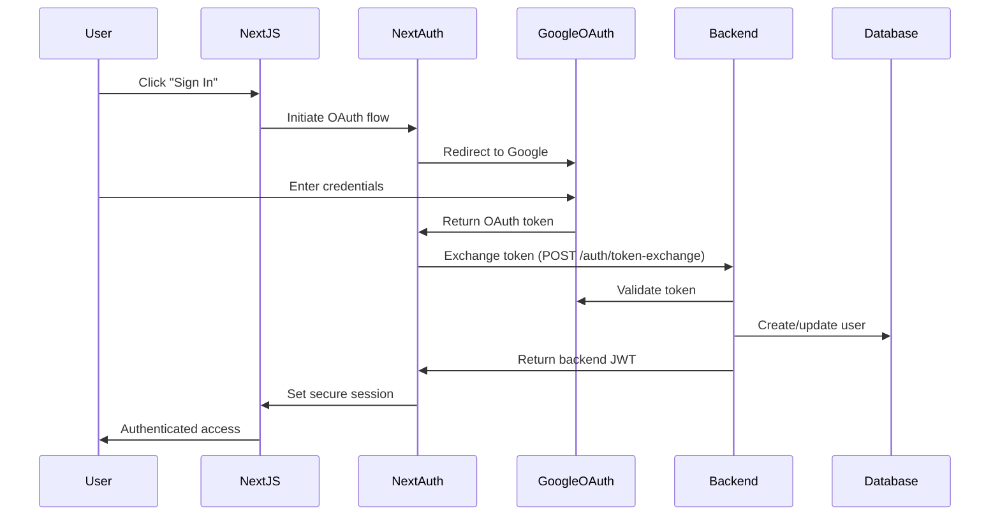

# CMB Cluster Authentication Security Implementation

## Overview
This document outlines the highly secure authentication implementation for the CMB Cluster platform, designed for public-facing deployment with enterprise-grade security.

## Security Features Implemented

### 1. **Frontend Security (Next.js)**

#### NextAuth.js Configuration
- **Secure JWT Strategy**: JWT tokens with short expiration (8 hours)
- **Token Exchange**: Google OAuth tokens exchanged for backend JWT tokens
- **Secure Cookies**: HttpOnly, Secure, SameSite cookies in production
- **CSRF Protection**: Built-in CSRF token validation
- **Email Verification**: Mandatory email verification check
- **Session Management**: Automatic session refresh and cleanup

#### Security Headers
- **Content Security Policy (CSP)**: Strict CSP preventing XSS attacks
- **HSTS**: HTTP Strict Transport Security for HTTPS enforcement
- **X-Frame-Options**: Prevent clickjacking attacks
- **X-Content-Type-Options**: Prevent MIME type sniffing
- **Referrer Policy**: Control referrer information leakage

### 2. **Backend Security (FastAPI)**

#### JWT Token Security
- **Strong Secret Keys**: Minimum 32-character secrets, validated at startup
- **Token Claims**: Comprehensive JWT claims with issuer/audience validation
- **Token Rotation**: Automatic token refresh with rotation
- **Token Blacklisting**: Support for token revocation (implement as needed)
- **Unique Token IDs**: JWT ID (jti) for tracking individual tokens

#### Rate Limiting
- **Authentication Endpoints**: 10 attempts per hour per IP
- **API Endpoints**: 60 requests per minute per IP
- **Progressive Penalties**: Temporary IP blocking for repeated violations
- **Distributed Rate Limiting**: Redis support for cluster deployments

#### OAuth Security
- **Google Token Validation**: Server-side verification of Google tokens
- **Email Verification**: Mandatory email verification enforcement
- **Secure Token Exchange**: Protected endpoint for token conversion
- **Audit Logging**: Comprehensive security event logging

### 3. **Network Security**

#### CORS Configuration
- **Strict Origins**: Whitelist-based origin validation
- **Development vs Production**: Different policies for each environment
- **Credential Support**: Secure credential handling with proper validation
- **Preflight Caching**: Optimized preflight request handling

#### Request Validation
- **Header Validation**: Required security headers on all requests
- **Input Sanitization**: Prevention of common injection attacks
- **Request Size Limits**: Prevent DoS attacks via large requests
- **Timeout Configuration**: Reasonable timeouts to prevent resource exhaustion

### 4. **Production Security Checklist**

#### Environment Variables (Required)
```bash
# Frontend (.env.local)
NEXTAUTH_SECRET=your-256-bit-secret-key-here
GOOGLE_CLIENT_ID=your-google-oauth-client-id
GOOGLE_CLIENT_SECRET=your-google-oauth-client-secret
NEXTAUTH_URL=https://yourdomain.com
NEXT_PUBLIC_API_URL=https://api.yourdomain.com

# Backend (.env)
SECRET_KEY=your-strong-secret-key-minimum-32-chars
GOOGLE_CLIENT_ID=your-google-oauth-client-id
GOOGLE_CLIENT_SECRET=your-google-oauth-client-secret
DEV_MODE=false
DEBUG=false
TLS_ENABLED=true
```

#### Security Validations
- [ ] Strong secret keys (minimum 32 characters)
- [ ] Google OAuth credentials configured
- [ ] TLS/HTTPS enabled in production
- [ ] Debug mode disabled
- [ ] Secure cookies enabled
- [ ] Rate limiting configured
- [ ] Audit logging enabled
- [ ] CORS origins restricted

### 5. **Authentication Flow**



### 6. **Token Lifecycle**

1. **Initial Authentication**
   - User signs in with Google OAuth
   - Google token validated server-side
   - Backend JWT issued with 8-hour expiration
   - Session stored in secure HTTP-only cookies

2. **Token Refresh**
   - Automatic refresh when < 1 hour remaining
   - New token issued with fresh user data
   - Old token invalidated (when blacklisting implemented)

3. **Token Validation**
   - Every API request validates JWT signature
   - Audience and issuer claims verified
   - Expiration and not-before timestamps checked
   - User status validated against database

4. **Session Termination**
   - Manual logout clears all session data
   - Automatic logout on token expiration
   - Server-side token invalidation capability

### 7. **Security Monitoring**

#### Audit Events Logged
- Authentication attempts (success/failure)
- Token refresh/validation events
- Rate limiting violations
- Security header violations
- Suspicious activity patterns

#### Alert Triggers
- Multiple failed authentication attempts
- Token validation failures
- Rate limit threshold breaches
- Unexpected error patterns
- Configuration security warnings

### 8. **Best Practices Implemented**

#### Code Security
- **Input Validation**: All inputs validated and sanitized
- **Error Handling**: Generic error messages to prevent information disclosure
- **Dependency Security**: Regular security updates for all dependencies
- **Secrets Management**: Environment-based secret configuration

#### Operational Security
- **Least Privilege**: Minimal required permissions for all components
- **Regular Updates**: Automated security patches and updates
- **Backup Security**: Encrypted backups with access controls
- **Incident Response**: Structured logging for security incident investigation

### 9. **Development vs Production**

#### Development Mode Features
- Extended token expiration for testing
- Additional debug logging
- Relaxed CORS for local development
- Warning messages for security issues

#### Production Mode Enforcements
- Strict secret key validation
- Mandatory HTTPS/TLS
- Restrictive CORS policies
- Disabled debug endpoints
- Enhanced rate limiting

### 10. **Compliance Considerations**

#### Data Protection
- **GDPR Compliance**: User data minimization and consent
- **Data Encryption**: All sensitive data encrypted in transit and at rest
- **Access Logging**: Comprehensive audit trails
- **Right to Deletion**: User data removal capabilities

#### Security Standards
- **OWASP Top 10**: Protection against all major web vulnerabilities
- **OAuth 2.0 Security**: RFC 6749 and security best practices
- **JWT Security**: RFC 7519 with additional security measures
- **Transport Security**: TLS 1.3 with modern cipher suites

## Implementation Status

- ✅ Secure JWT token handling
- ✅ Enhanced rate limiting
- ✅ Google OAuth validation
- ✅ Security headers implementation
- ✅ CORS configuration
- ✅ Audit logging
- ✅ Error handling
- ✅ Session management
- ✅ Token refresh mechanism
- ✅ Production validation

## Next Steps

1. **Redis Integration**: Implement Redis for distributed rate limiting and session storage
2. **Token Blacklisting**: Add token revocation capability for immediate logout
3. **Security Monitoring**: Integrate with security monitoring tools
4. **Penetration Testing**: Conduct security assessment
5. **Documentation**: Complete security runbook and incident response procedures

This implementation provides enterprise-grade security suitable for public-facing deployment while maintaining usability and performance.
