# Architecture

## System Overview

CMBCluster is a multi-tenant platform supporting multiple application types from different container image sources.

```mermaid
graph TB
    subgraph users["👥 User Layer"]
        user1["👤 Researchers"]
        user2["👤 Data Scientists"]
        user3["👤 ML Engineers"]
    end
    
    subgraph internet["🌐 Internet Connection"]
        tls["🔒 TLS 1.3 Encryption"]
    end
    
    subgraph infra["☸️ Kubernetes Cluster (cmbcluster namespace)"]
        subgraph ingress_layer["Ingress & Auth Layer"]
            nginx["🌐 NGINX Ingress<br/>Port 443 HTTPS<br/>Load Balancing & TLS"]
            oauth["🔐 OAuth 2.0<br/>Google Authentication"]
            rbac["👮 RBAC<br/>Role-Based Access Control"]
        end
        
        subgraph app_layer["Application Layer"]
            frontend["📊 Frontend<br/>Next.js Dashboard<br/>Port 3000"]
            api["⚙️ Backend API<br/>FastAPI Server<br/>Port 8000"]
        end
        
        subgraph data_layer["Data Layer"]
            db["🗄️ Database<br/>PostgreSQL<br/>Port 5432"]
            cache["⚡ Cache<br/>Redis Optional"]
        end
        
        subgraph registry_layer["Image Registry & Sources"]
            registry["🐳 Docker Images<br/>📦 Docker Hub<br/>🔐 Private Registry<br/>📂 Local Images"]
        end
        
        subgraph runtime_layer["Runtime Layer - Multi-Agent Research Environments"]
            cmbagent["🤖 CMBAgent<br/>Agentic AI<br/>Autonomous Tasks"]
            denario["🔬 Denario<br/>ML & Research<br/>Computations"]
            custom["⚙️ Custom Research<br/>Frameworks<br/>User-defined"]
        end
        
        subgraph storage_layer["Storage Layer"]
            user_pvc["💾 User Workspaces<br/>PVC per Environment<br/>10GB Default"]
            shared_pvc["📁 Shared Storage<br/>Files & Models<br/>Encrypted using Fernet (symmetric)"]
        end
    end
    
    subgraph external["☁️ External Services"]
        gcs["Google Cloud<br/>Storage"]
    end
    
    user1 --> tls
    user2 --> tls
    user3 --> tls
    
    tls --> nginx
    
    nginx --> frontend
    nginx --> api
    
    api --> oauth
    api --> rbac
    api --> db
    api --> cache
    api --> registry
    
    frontend --> api
    
    registry --> cmbagent
    registry --> denario
    registry --> custom
    
    api --> cmbagent
    api --> denario
    api --> custom
    
    cmbagent --> user_pvc
    denario --> user_pvc
    custom --> user_pvc
    
    cmbagent --> shared_pvc
    denario --> shared_pvc
    custom --> shared_pvc
    
    api --> gcs
    
    style users fill:#f9f,stroke:#333,stroke-width:2px,color:#000
    style tls fill:#1890ff,stroke:#333,stroke-width:2px,color:#fff
    style nginx fill:#ff6b6b,stroke:#333,stroke-width:2px,color:#fff
    style oauth fill:#ff6b6b,stroke:#333,stroke-width:2px,color:#fff
    style rbac fill:#ff6b6b,stroke:#333,stroke-width:2px,color:#fff
    style frontend fill:#1890ff,stroke:#333,stroke-width:2px,color:#fff
    style api fill:#1890ff,stroke:#333,stroke-width:2px,color:#fff
    style db fill:#52c41a,stroke:#333,stroke-width:2px,color:#fff
    style cache fill:#52c41a,stroke:#333,stroke-width:2px,color:#fff
    style registry fill:#ff7a45,stroke:#333,stroke-width:2px,color:#fff
    style research fill:#faad14,stroke:#333,stroke-width:2px,color:#000
    style cmbagent fill:#faad14,stroke:#333,stroke-width:2px,color:#000
    style denario fill:#faad14,stroke:#333,stroke-width:2px,color:#000
    style custom fill:#faad14,stroke:#333,stroke-width:2px,color:#000
    style user_pvc fill:#13c2c2,stroke:#333,stroke-width:2px,color:#fff
    style shared_pvc fill:#13c2c2,stroke:#333,stroke-width:2px,color:#fff
```



## Component Architecture

### NGINX Ingress Controller

**Responsibilities:**
- Route HTTP/HTTPS traffic to services
- TLS termination with automatic certificate renewal
- Load balancing across replicas
- Path-based routing (`/` → frontend, `/api/` → backend)
- Rate limiting and DDoS protection

**Deployment:** Single ingress managing all traffic

### Next.js Frontend

**Tech Stack:** Node.js 18, React, TypeScript, Tailwind CSS, Ant Design

**Key Features:**
- OAuth login flow and session management
- Environment CRUD operations
- File management interface
- Activity monitoring and logs
- Settings and preferences
- Real-time pod status updates

**Port:** 3000 (internal), 8501 (external via ingress)

**Deployment:** 2+ replicas with auto-scaling

### FastAPI Backend

**Tech Stack:** Python 3.11, FastAPI, async/await, Pydantic

**Key Responsibilities:**

1. **Authentication** (`/auth/*`)
   - Google OAuth callback handling
   - JWT token generation and validation
   - Session management
   - User info endpoints

2. **Environment Management** (`/environments/*`)
   - Create/delete Kubernetes pods
   - Track environment status
   - Auto-shutdown based on uptime
   - Multi-environment support per user

3. **File Management** (`/user-files/*`)
   - Upload/download files
   - Encrypt files at rest
   - Manage persistent volumes
   - Storage quota enforcement

4. **Storage Integration** (`/storage/*`)
   - GCS/S3 backend management
   - Cloud volume mounting
   - Storage authentication

5. **Admin Operations** (`/admin/*`)
   - User management
   - Application catalog
   - Cluster monitoring
   - Activity logging

6. **Database Operations**
   - User records
   - Environment status
   - Activity logs
   - Encryption keys (encrypted)

**Port:** 8000 (internal and external)

**Deployment:** 2+ replicas with auto-scaling

### Database

**Type:** SQLite (dev) or PostgreSQL (production)

**Schema:**

```
users
├── id (primary key)
├── email (unique)
├── role (admin/user)
├── subscription_tier (free/premium)
├── created_at
└── updated_at

environments
├── env_id (primary key)
├── user_id (foreign key)
├── pod_name
├── status (running/stopped/failed)
├── created_at
├── uptime_minutes
└── metadata (JSON)

activity_logs
├── id (primary key)
├── user_id (foreign key)
├── action (string)
├── details (text)
├── timestamp
└── status (success/error)

files
├── id (primary key)
├── user_id (foreign key)
├── filename
├── size_bytes
├── encrypted (boolean)
├── created_at
└── path

user_env_vars
├── id (primary key)
├── user_id (foreign key)
├── key (name)
└── value (encrypted)
```

### User Environment Pods

**Components:**
- Multi-agent research environment (web UI port 8501 when applicable)
- Python runtime with scientific libraries
- Persistent volume at `/workspace`
- Environment variables injected
- Non-root user execution
- Resource limits enforced

**Libraries:**
- NumPy, SciPy, Pandas, Matplotlib
- Plotly, Seaborn
- Astropy, HEALPy, CAMB (CMB-specific)
- scikit-learn, TensorFlow, PyTorch (optional)

**Lifecycle:**
1. User requests environment creation
2. Backend validates user quotas
3. Kubernetes creates pod with user's image
4. Pod pulls image and mounts volumes
5. Research environment (web UI) starts; port depends on the app (commonly 8501)
6. User accesses via browser/ingress
7. Backend monitors uptime
8. Auto-shutdown after max uptime (free tier)

## Data Flow

### User Login Flow


### Environment Creation Flow

```mermaid
sequenceDiagram
    participant User as 👤 User
    participant Frontend as 📊 Frontend
    participant Backend as ⚙️ Backend
    participant Registry as 🐳 Image Registry
    participant K8s as ☸️ Kubernetes
    participant Pod as 🚀 Application Pod
    
    User->>Frontend: Click "Launch Environment"
    Frontend->>Frontend: Select app type & image
    Note over Frontend: • Multi-Agent Research Environments<br/>• CMBAgent<br/>• Denario<br/>• Custom Docker Image
    
    Frontend->>Backend: POST /environments<br/>{ app_type, image_uri }
    Backend->>Backend: Validate quotas & permissions
    
    Backend->>Registry: Resolve image<br/>(Docker Hub, Private Registry, Local)
    Registry->>Backend: Image metadata & digest
    
    Backend->>K8s: Create pod manifest
    Note over Backend: Mount volumes<br/>Set resource limits<br/>Inject env vars
    
    K8s->>K8s: Schedule pod on node
    K8s->>Registry: Pull container image
    Registry->>K8s: Stream image layers
    
    K8s->>Pod: Create container<br/>Mount volumes<br/>Start application
    Pod->>Pod: Application initializes
    Pod->>K8s: Health check passes
    
    K8s->>Backend: Pod is ready
    Backend->>Frontend: Return pod URL & access info
    
    Frontend->>User: Show "Environment Ready"
    User->>Pod: Click to connect
    Pod->>User: Application interface loaded
    
    Note over Backend: Monitor uptime
    Loop Every 5 minutes
        Backend->>K8s: Check pod health
        Backend->>Backend: If > 60 min: mark for shutdown
        Backend->>User: Send warning if pending
    End
```



### File Upload Flow

```mermaid
sequenceDiagram
    participant User as 👤 User
    participant Frontend as 📊 Frontend
    participant Backend as ⚙️ Backend
    participant Storage as 💾 Storage
    participant Pod as 🔬 User Pod
    
    User->>Frontend: Select file
    Frontend->>Backend: POST /user-files/upload (multipart)
    
    Backend->>Backend: Validate file & quota
    Backend->>Backend: Encrypt file contents
    Backend->>Storage: Write encrypted file
    Storage->>Backend: File saved
    
    Backend->>Backend: Update database metadata
    Backend->>Frontend: Upload successful
    Frontend->>User: Show in file list
    
    User->>Pod: Access /workspace/
    Pod->>Storage: Read encrypted file
    Storage->>Pod: Encrypted data
    Pod->>Pod: Decrypt file (in memory)
    Pod->>User: File available to scripts
```



## Kubernetes Resources

```mermaid
graph TB
    subgraph cluster["Kubernetes Cluster"]
        subgraph ns["cmbcluster Namespace"]
            subgraph rbac["RBAC & Auth"]
                sa1["🔑 ServiceAccount:<br/>backend"]
                sa2["🔑 ServiceAccount:<br/>frontend"]
                sa3["🔑 ServiceAccount:<br/>pod-manager"]
                role["👮 ClusterRole:<br/>pod-lifecycle"]
            end
            
            subgraph deployments["Deployments"]
                backend["🖥️ Backend<br/>3 replicas<br/>FastAPI"]
                frontend["🎨 Frontend<br/>3 replicas<br/>Next.js"]
            end
            
            subgraph services["Services"]
                svc-backend["🔌 Service: backend<br/>ClusterIP:8000"]
                svc-frontend["🔌 Service: frontend<br/>ClusterIP:3000"]
            end
            
            subgraph ingress-res["Ingress & Certificates"]
                ingress["🌐 Ingress Resource<br/>Routes /api/* → backend<br/>Routes /* → frontend"]
                cert["📜 cert-manager<br/>Let's Encrypt"]
            end
            
            subgraph config["Configuration"]
                configmap["📋 ConfigMaps<br/>app-config<br/>nginx-config"]
                secrets["🔐 Secrets<br/>oauth-credentials<br/>db-password<br/>encryption-keys"]
            end
            
            subgraph storage["Storage & Persistence"]
                db-pvc["💾 PVC: database<br/>PostgreSQL data<br/>10GB"]
                file-pvc["💾 PVC: file-storage<br/>Encrypted uploads"]
                user-pvc["💾 PVC: workspaces<br/>Per-environment<br/>10GB each"]
            end
            
            subgraph registry["Image Registry Access"]
                dockerhub["🐳 Docker Hub<br/>Public Images"]
                privatreg["🔐 Private Registry<br/>Authenticated Access"]
                localimg["📂 Local Images<br/>Custom Built"]
            end
            
            subgraph apppods["Application Pods (Dynamic)"]
                research["🚀 Multi-Agent Research<br/>Environments"]
                cmbagent["🤖 CMBAgent<br/>Agentic AI"]
                denario["🔬 Denario<br/>ML Research"]
                custom["⚙️ Custom Research<br/>Frameworks & Images"]
            end
            
            subgraph netpol["Network Policies"]
                np["🛡️ Pod-to-Pod Isolation<br/>FE ↔ BE: allowed<br/>BE ↔ pods: allowed<br/>Pod ↔ Pod: blocked"]
            end
        end
        
        subgraph ns-ingress["ingress-nginx Namespace"]
            nginx["🔗 NGINX Controller<br/>LoadBalancer<br/>Ports: 80, 443"]
        end
    end
    
    internet["🌐 Internet<br/>Client Requests"]
    
    internet -->|HTTPS| nginx
    nginx -->|Route /api| ingress
    nginx -->|Route /| ingress
    
    ingress -->|forward| svc-backend
    ingress -->|forward| svc-frontend
    
    svc-backend -->|pod select| backend
    svc-frontend -->|pod select| frontend
    
    backend -->|resolve images| registry
    backend -->|mount| db-pvc
    backend -->|mount| file-pvc
    backend -->|mount| user-pvc
    backend -->|ref| secrets
    backend -->|ref| configmap
    
    frontend -->|ref| configmap
    
    cert -->|manage| ingress
    
    registry --> dockerhub
    registry --> privatreg
    registry --> localimg
    
    backend -->|create/manage| apppods
    
    dockerhub --> research
    privatreg --> cmbagent
    localimg --> denario
    dockerhub --> custom
    research -->|mount| user-pvc
    cmbagent -->|mount| user-pvc
    denario -->|mount| user-pvc
    custom -->|mount| user-pvc
    research -->|read/write| file-pvc
    cmbagent -->|read/write| file-pvc
    denario -->|read/write| file-pvc
    custom -->|read/write| file-pvc
    
    sa1 -.->|bind| backend
    sa2 -.->|bind| frontend
    sa3 -.->|bind| role
    
    np -.->|enforce| ns
    
    style backend fill:#1890ff,stroke:#333,stroke-width:2px,color:#fff
    style frontend fill:#1890ff,stroke:#333,stroke-width:2px,color:#fff
    style svc-backend fill:#52c41a,stroke:#333,stroke-width:2px,color:#fff
    style svc-frontend fill:#52c41a,stroke:#333,stroke-width:2px,color:#fff
    style nginx fill:#ff6b6b,stroke:#333,stroke-width:2px,color:#fff
    style secrets fill:#ff7a45,stroke:#333,stroke-width:2px,color:#fff
    style dockerhub fill:#ff7a45,stroke:#333,stroke-width:2px,color:#fff
    style privatreg fill:#ff7a45,stroke:#333,stroke-width:2px,color:#fff
    style localimg fill:#ff7a45,stroke:#333,stroke-width:2px,color:#fff
    style research fill:#faad14,stroke:#333,stroke-width:2px,color:#000
    style cmbagent fill:#faad14,stroke:#333,stroke-width:2px,color:#000
    style denario fill:#faad14,stroke:#333,stroke-width:2px,color:#000
    style custom fill:#faad14,stroke:#333,stroke-width:2px,color:#000
```



## Security Architecture


### Key Security Features

**Authentication:**
- OAuth 2.0 with Google for initial login
- JWT tokens for API authentication
- Tokens stored in secure, HttpOnly cookies
- Automatic token refresh on expiration

**Authorization:**
- RBAC (Role-Based Access Control) for user actions
- ServiceAccount permissions limit pod creation rights
- Environment variables scoped per user

**Data Protection:**
- Files encrypted using Fernet (authenticated symmetric encryption)
- TLS 1.3 for data in transit
- Kubernetes Secrets for credential storage
- Database credentials never exposed to frontend

**Network Security:**
- TLS termination at ingress layer
- Network Policies restrict inter-pod communication
- RBAC at Kubernetes level controls API access
- CORS headers prevent unauthorized cross-origin requests

**Session Security:**
- HttpOnly cookies prevent JavaScript access
- Secure flag enforces HTTPS only
- SameSite cookie attribute prevents CSRF
- Session timeout on inactivity

## Scaling Architecture

### Horizontal Scaling
- Frontend replicas: 1-10 (configurable)
- Backend replicas: 1-10 (configurable)
- User pods: 1-many (no centralized limit, per-user quota)

### Load Balancing
- NGINX: Round-robin across frontend/backend replicas
- Kubernetes: Service DNS for inter-pod communication

### Resource Limits
- Backend pod: 0.1-1 CPU, 256MB-1GB RAM
- Frontend pod: 0.1-1 CPU, 256MB-1GB RAM
- User pod: 0.1-2 CPU, 256MB-4GB RAM (configurable)

### Auto-scaling
- Based on CPU utilization (70% threshold)
- Scales up quickly, scales down slowly
- Min/max replica limits

## Deployment Patterns

### Development
- Docker Compose (single machine)
- All services in one docker-compose.yml
- SQLite database
- No TLS (HTTP only)

### Production (GKE/EKS/AKS)
- Kubernetes cluster (3+ nodes)
- Helm charts for declarative deployment
- PostgreSQL database
- TLS with cert-manager
- Auto-scaling enabled
- Monitoring/logging optional

## Disaster Recovery

### Data Backup
- Database: Daily snapshots
- User workspaces: Hourly snapshots (optional)
- Configuration: Stored in Git/ConfigMaps

### Pod Recovery
- Liveness probes: Restart failed pods
- Readiness probes: Remove unhealthy from load balancer
- StatefulSets: Guaranteed ordering for stateful services

### Cluster Recovery
- Multi-node cluster: Workloads migrate on node failure
- Persistent volumes: Survive pod/node failures
- Secrets: Stored in etcd with replication
