# Security & Authentication

Comprehensive security documentation for CMBCluster.

## Authentication Architecture

CMBCluster uses OAuth 2.0 with Google for single sign-on, combined with JWT tokens for API authentication.

### OAuth 2.0 Flow

```mermaid
sequenceDiagram
    participant User as 👤 User/Browser
    participant Frontend as 📊 Frontend
    participant Backend as ⚙️ Backend
    participant Google as 🔐 Google OAuth
    participant Database as 🗄️ Database
    
    User->>Frontend: Visit platform
    Frontend->>User: Show login button
    
    User->>Frontend: Click "Login with Google"
    Frontend->>Backend: GET /auth/login
    
    Backend->>Backend: Generate CSRF state token
    Backend->>Google: Redirect to OAuth consent
    Note over Google: Authorization endpoint:<br/>accounts.google.com/o/oauth2/v2/auth?<br/>client_id=...&redirect_uri=...&scope=...
    
    Google->>User: Show consent screen
    User->>Google: Authorize CMBCluster
    
    Google->>Backend: Redirect to /auth/callback<br/>with code & state
    Backend->>Backend: Verify state token (CSRF)
    Backend->>Google: POST /token<br/>Exchange code for tokens
    Google->>Backend: Return access_token & user info
    
    Backend->>Backend: Validate token signature
    Backend->>Database: Get or create user record
    Database->>Backend: User profile
    
    Backend->>Backend: Create JWT token<br/>(exp: 8 hours)
    Backend->>Backend: Create session cookie<br/>(HttpOnly, Secure, SameSite)
    Backend->>User: Redirect to dashboard<br/>Set-Cookie: session=...
    
    User->>Frontend: Load dashboard
    Frontend->>Backend: GET /environments<br/>Cookie: session=...
    
    Backend->>Backend: Validate JWT signature
    Backend->>Backend: Verify expiration
    Backend->>Backend: Verify user permissions
    Backend->>Database: Query user environments
    Database->>Backend: Return data
    Backend->>Frontend: 200 OK + environments
    
    Frontend->>User: Display environments
```



### JWT Token Structure

```
Header:
{
  "alg": "HS256",
  "typ": "JWT"
}

Payload:
{
  "sub": "user-id-123",
  "email": "user@example.com",
  "role": "user",
  "iat": 1705338600,
  "exp": 1705370600,
  "iss": "cmbcluster"
}

Signature:
HMACSHA256(
  base64UrlEncode(header) + "." +
  base64UrlEncode(payload),
  SECRET_KEY
)
```

### Session Management

**Cookie Settings:**
- Name: `session`
- HttpOnly: True (prevents JavaScript access)
- Secure: True (HTTPS only)
- SameSite: Strict (prevents CSRF)
- Max-Age: 8 hours (configurable via TOKEN_EXPIRE_HOURS)
- Path: `/`

**Session Refresh:**
- Tokens valid for 8 hours by default
- Tokens automatically refreshed if < 1 hour remaining
- User must re-login if token expires

---

## Authorization & Access Control

### Role-Based Access Control (RBAC)

**User Roles:**

| Role | Permissions |
|------|-------------|
| **user** | Create/delete own environments<br/>Manage own files<br/>View own activity<br/>Configure own settings |
| **admin** | All user permissions +<br/>View all users<br/>View all environments<br/>View all activity<br/>Delete user pods<br/>Configure applications<br/>Manage admin settings |

### Permission Matrix

| Resource | User | Admin |
|----------|------|-------|
| Own Environment | Create, Read, Delete | All ops |
| Other User Environment | None | Read, Delete |
| Own Files | Create, Read, Delete | All ops |
| Other User Files | None | Read, Delete |
| Own Activity | Read | All ops |
| All Activity | None | Read |
| Settings | Own only | All |
| Users | View self | View all |

### Kubernetes RBAC

```yaml
# Service account for backend
apiVersion: v1
kind: ServiceAccount
metadata:
  name: cmbcluster-backend
  namespace: cmbcluster

---
# Role for pod management
apiVersion: rbac.authorization.k8s.io/v1
kind: Role
metadata:
  name: pod-manager
  namespace: cmbcluster
rules:
- apiGroups: [""]
  resources: ["pods"]
  verbs: ["create", "delete", "get", "list", "watch"]
- apiGroups: [""]
  resources: ["secrets"]
  verbs: ["create", "delete", "get", "list"]
- apiGroups: [""]
  resources: ["persistentvolumeclaims"]
  verbs: ["create", "delete", "get", "list"]

---
# Bind role to service account
apiVersion: rbac.authorization.k8s.io/v1
kind: RoleBinding
metadata:
  name: backend-pod-manager
  namespace: cmbcluster
roleRef:
  apiGroup: rbac.authorization.k8s.io
  kind: Role
  name: pod-manager
subjects:
- kind: ServiceAccount
  name: cmbcluster-backend
  namespace: cmbcluster
```

---

## Network Security

### TLS/HTTPS & Encryption Flow

```mermaid
graph LR
    subgraph internet["Internet"]
        user["👤 User<br/>Browser"]
    end
    
    subgraph tls1["TLS 1.3 Encrypted"]
        arrow1["🔒 Encrypted<br/>Connection"]
    end
    
    subgraph k8s["Kubernetes Cluster"]
        subgraph tls2["mTLS (Recommended)"]
            arrow2["🔒 Encrypted"]
        end
        
        ingress["🌐 NGINX Ingress<br/>Port 443<br/>Let's Encrypt"]
        frontend["📊 Frontend<br/>Port 3000"]
        backend["⚙️ Backend<br/>Port 8000"]
        
        subgraph tls3["Internal Cluster<br/>(mTLS recommended)"]
            arrow3["🔒 Encrypted"]
        end
        
        db["🗄️ Database<br/>PostgreSQL"]
    end
    
    subgraph external["External"]
        google["🔐 Google OAuth<br/>HTTPS/TLS"]
        gcs["☁️ Cloud Storage<br/>HTTPS/TLS"]
    end
    
    user -->|HTTPS<br/>TLS 1.3| arrow1
    arrow1 --> ingress
    
    ingress -->|Route /*| frontend
    ingress -->|Route /api| arrow2
    arrow2 --> backend
    
    frontend -->|API calls| arrow2
    
    backend -->|Query| arrow3
    arrow3 --> db
    
    backend -->|Auth| google
    backend -->|File ops| gcs
    
    ingress -.->|Cert by<br/>cert-manager| ingress
    
    style user fill:#f9f,stroke:#333,stroke-width:2px,color:#000
    style arrow1 fill:#1890ff,stroke:#333,stroke-width:2px,color:#fff
    style arrow2 fill:#1890ff,stroke:#333,stroke-width:2px,color:#fff
    style arrow3 fill:#1890ff,stroke:#333,stroke-width:2px,color:#fff
    style ingress fill:#ff6b6b,stroke:#333,stroke-width:2px,color:#fff
    style google fill:#ff7a45,stroke:#333,stroke-width:2px,color:#fff
    style gcs fill:#ff7a45,stroke:#333,stroke-width:2px,color:#fff
    style db fill:#52c41a,stroke:#333,stroke-width:2px,color:#fff
```



**TLS Configuration:**
- **TLS Version:** 1.3 minimum
- **Certificate:** Let's Encrypt (free, auto-renewed via cert-manager)
- **Auto-Renewal:** Every 90 days (automatic)
- **HSTS:** Enabled (31536000 seconds / 1 year)

**HSTS Header:**
```
Strict-Transport-Security: max-age=31536000; includeSubDomains; preload
```

**Encryption Paths:**
1. **User ↔ NGINX:** TLS 1.3, client-server encryption
2. **NGINX ↔ Backend:** Internal (optional mTLS for defense-in-depth)
3. **Backend ↔ Database:** SSL/TLS encrypted
4. **Backend ↔ Google OAuth:** HTTPS/TLS
5. **Backend ↔ Cloud Storage:** HTTPS/TLS

### CORS Policy

**Allowed Origins:**
```
https://your-domain.com
https://api.your-domain.com
https://www.your-domain.com (optional)
```

**Allowed Methods:**
```
GET, POST, PUT, DELETE, OPTIONS
```

**Allowed Headers:**
```
Authorization, Content-Type, X-Requested-With, X-CSRF-Token
```

### Network Policies

Kubernetes network policies restrict pod-to-pod communication:

```yaml
apiVersion: networking.k8s.io/v1
kind: NetworkPolicy
metadata:
  name: user-pod-isolation
  namespace: cmbcluster
spec:
  podSelector:
    matchLabels:
      app: user-environment
  policyTypes:
  - Ingress
  - Egress
  ingress:
  - from:
    - podSelector:
        matchLabels:
          app: cmbcluster-backend
    ports:
    - protocol: TCP
      port: 8501
  egress:
  - to:
    - podSelector:
        matchLabels:
          app: cmbcluster-backend
    ports:
    - protocol: TCP
      port: 8000
  - to:
    - namespaceSelector: {}
    ports:
    - protocol: TCP
      port: 53  # DNS
```

### Ingress Security

**Security Headers:**
```
X-Content-Type-Options: nosniff
X-Frame-Options: DENY
X-XSS-Protection: 1; mode=block
Referrer-Policy: strict-origin-when-cross-origin
Permissions-Policy: geolocation=(), microphone=(), camera=()
Content-Security-Policy: default-src 'self'; script-src 'self' https://accounts.google.com; ...
```

**NGINX Ingress Configuration:**
```yaml
apiVersion: networking.k8s.io/v1
kind: Ingress
metadata:
  name: cmbcluster-ingress
  namespace: cmbcluster
  annotations:
    cert-manager.io/cluster-issuer: letsencrypt-prod
    nginx.ingress.kubernetes.io/ssl-redirect: "true"
    nginx.ingress.kubernetes.io/force-ssl-redirect: "true"
    nginx.ingress.kubernetes.io/proxy-body-size: 100m
spec:
  ingressClassName: nginx
  tls:
  - secretName: cmbcluster-tls
    hosts:
    - your-domain.com
    - api.your-domain.com
  rules:
  - host: your-domain.com
    http:
      paths:
      - path: /
        pathType: Prefix
        backend:
          service:
            name: cmbcluster-frontend
            port:
              number: 3000
  - host: api.your-domain.com
    http:
      paths:
      - path: /
        pathType: Prefix
        backend:
          service:
            name: cmbcluster-backend
            port:
              number: 8000
```

---

## Data Protection

### Encryption at Rest & in Transit


- **Encryption at Rest:**
- **Files:** User-uploaded files encrypted using Fernet (authenticated symmetric encryption). The service derives a Fernet key (via PBKDF2/SHA256) from the configured `FILE_ENCRYPTION_KEY` or passphrase; the key material (or passphrase) should be stored in Kubernetes secrets and never checked into source control.
- **Secrets:** Environment variables stored as K8s secrets; encrypted by etcd (Kubernetes default)
- **Database:** 
  - SQLite: Unencrypted by default, use `--sqlite-encryption` flag for encrypted mode
  - PostgreSQL: Use SSL/TLS connections + optional column-level encryption for sensitive data

**Encryption in Transit:**
- **User ↔ NGINX:** TLS 1.3, mandatory encryption
- **NGINX ↔ Backend:** Internal cluster (mTLS recommended for production)
- **Backend ↔ Database:** SSL/TLS encrypted connections
- **Backend ↔ External Services:** HTTPS/TLS (Google OAuth, Cloud Storage)

**Key Management:**
- Encryption keys generated using `openssl rand -base64 32`
- Keys stored in Kubernetes secrets, never in code
- Automatic key rotation policies recommended for production
- Each environment has isolated keys for data separation

### Encryption Keys

```bash
# Generate encryption key
openssl rand -base64 32

# Store in Kubernetes secret
kubectl create secret generic encryption-keys \
  --from-literal=file-encryption-key=KEY_VALUE \
  -n cmbcluster

# Rotate keys (requires re-encryption of data)
# 1. Create new secret with new key
# 2. Re-encrypt all data with new key
# 3. Delete old secret
```

---

## Secret Management

### Kubernetes Secrets

Secrets stored in `/etc/cmbcluster/secrets/`:

```yaml
# OAuth credentials
apiVersion: v1
kind: Secret
metadata:
  name: oauth-credentials
  namespace: cmbcluster
type: Opaque
data:
  google_client_id: base64_encoded_value
  google_client_secret: base64_encoded_value

---
# Application secrets
apiVersion: v1
kind: Secret
metadata:
  name: app-secrets
  namespace: cmbcluster
type: Opaque
data:
  secret_key: base64_encoded_value

---
# Database credentials
apiVersion: v1
kind: Secret
metadata:
  name: db-credentials
  namespace: cmbcluster
type: Opaque
data:
  username: base64_encoded_value
  password: base64_encoded_value
```

### Secret Rotation

```bash
# Update secret without pod restart
kubectl patch secret oauth-credentials \
  -p '{"data":{"google_client_secret":"new_base64_value"}}' \
  -n cmbcluster

# Force pod restart to pick up new secret
kubectl rollout restart deployment/cmbcluster-backend -n cmbcluster
```

---

## Audit Logging

### Activity Logging

All user actions are logged:

```
User logins
Environment creation/deletion
File uploads/downloads/deletions
Environment variable changes
Settings modifications
Admin actions
Failed authentication attempts
```

### Access Logs

NGINX access logs include:
- Timestamp
- Client IP
- HTTP method and path
- Status code
- Response time
- User agent

### Security Event Logging

Backend logs security events:
- Failed login attempts
- Unauthorized access attempts
- Rate limiting triggers
- Pod creation/deletion
- File encryption/decryption
- Permission denials

---

## Security Checklist

### Pre-Deployment

- [ ] SECRET_KEY set to strong random value (min 32 chars)
- [ ] Google OAuth credentials configured
- [ ] TLS_ENABLED=true in configuration
- [ ] ENABLE_SECURITY_HEADERS=true
- [ ] DEV_MODE=false for production
- [ ] DEBUG=false for production
- [ ] Admin emails configured
- [ ] CORS allowed origins reviewed
- [ ] Rate limiting configured
- [ ] Session timeout appropriate
- [ ] Log retention policies set
- [ ] Database encryption enabled
- [ ] Backup automation enabled

### Post-Deployment

- [ ] TLS certificate verified (not self-signed)
- [ ] HSTS header present
- [ ] Security headers verified
- [ ] CORS policy tested
- [ ] Network policies enforced
- [ ] RBAC policies in place
- [ ] Secrets not exposed in logs
- [ ] Ingress access logs enabled
- [ ] Monitoring/alerting configured
- [ ] Backup tested and working
- [ ] Disaster recovery plan documented
- [ ] Security audit completed

### Ongoing

- [ ] Regular key rotation
- [ ] Security patches applied
- [ ] Dependency updates reviewed
- [ ] Access logs monitored
- [ ] Security events monitored
- [ ] Backups tested monthly
- [ ] Penetration testing scheduled
- [ ] Security audit annual

---

## Compliance

### Standards Implemented

- ✅ OWASP Top 10 protection
- ✅ NIST Cybersecurity Framework
- ✅ OAuth 2.0 / OIDC standards
- ✅ TLS 1.3 (encryption in transit)
- ✅ Input validation and sanitization
- ✅ SQL injection prevention
- ✅ XSS/CSRF protection
- ✅ Rate limiting
- ✅ Audit logging

### Certifications

For specific compliance requirements:
- **HIPAA**: Configure encryption, audit logging
- **GDPR**: Implement data deletion, user consent
- **SOC 2**: Enable monitoring, logging, access controls
- **PCI DSS**: Use TLS, protect credentials

---

## Common Security Patterns

### Secure User Isolation

Each user's pod is isolated:
- Separate container with own filesystem
- Separate persistent volume
- Network policies restrict communication
- RBAC prevents cross-user access
- Secrets stored per-user

### Rate Limiting

```python
# Per-user rate limits
- Authentication: 10 attempts/hour
- API requests: 60 requests/minute
- File uploads: 100MB per file, 1GB per user/day
```

### Input Validation

All user inputs validated:
```python
# Example: Environment variable validation
- Key: alphanumeric + underscores, max 128 chars
- Value: max 10KB, escaped for shell safety
```

### Secure Defaults

- HttpOnly cookies (no JavaScript access)
- Secure flag on all cookies (HTTPS only)
- SameSite=Strict (CSRF protection)
- CSP headers restrict resources
- X-Frame-Options prevents clickjacking
- No sensitive data in URLs or logs
